# АлкоКоллок `23.12.2025`

~~Черная пятница~~ `Красно-черный вторник. Акция: купи дерево - вырежи сына`

**Группа:** `M3108`

## Темы

- [x] 1. Оценка сложности алгоритма по времени
- [x] 2. Оценка сложности алгоритма по памяти
- [x] 3. Сортировка вставками
- [x] 4. Сортировка слиянием
- [x] 5. Быстрая сортировка
- [x] 6. Сортировка подсчетом
- [x] 7. Цифровая сортировка
- [x] 8. Стек
- [x] 9. Очередь
- [x] 10. Односвязный список
- [x] 11. Двусвязный список
- [x] 12. Циклический список
- [x] 13. Стек на списках
- [x] 14. Очередь на списках
- [x] 15. Пирамида (построе$ние пирамиды, восстановление свойств пирамиды)
- [x] 16. Построение пирамиды за O(n)
- [x] 17. Пирамидальная сортировка
- [x] 18. Удаление элемента из пирамиды
- [x] 19. Очередь с приоритетом (повышение / понижение приоритета)
- [x] 20. Динамическое программирование:
  - _кузнечик_
  - _рюкзак_
  - _нвп_
- [x] 21. Двоичное дерево поиска

**Дополнительно для 1-2 потоков:**

- [x] 1. Квикселект
- [x] 2. Мастер теорема как способ доказательства
- [x] 3. Дин прог:  
      - _битовые маски и задача по профилю_
      - _редакционное расстояние_
      - _расстановка знаков_
- [x] 4. Дек, Очередь с минимумом
- [x] 5. Бинпоиск: _lower_bound, по ответу, вещественный_
- [x] 6. Доп темы по деревьям:
        - _АВЛ_
        - _деревья отрезков_
        - _построение и основные операции_
        - _групповые обновления_
- [x] 7. Персистентность

## Асимптотика и Мастер-Теорема

### **Мастер-Теорема**

_Пусть имеется рекуррентное соотношения:_


---

### Примеры


---

## Сортировки

### **Вставками**

```cpp
void insertion_sort(int arr[], int n) {
    for (int j = 0; j < n; j++) {
        int k = arr[j];
        int i = j - 1;
        while (i >= 0 && arr[i] > k) {
            arr[i + 1] = arr[i];
            i--;
        }
        arr[i + 1] = k;
    }
}
```

---

| Характеристика | Значение |
|----------------|----------|
| **Лучшее время** | O(n) |
| **Среднее время** | O(n²) |
| **Худшее время** | O(n²) |
| **Память** | O(1) |
| **Инвариант** | На i-ой итерации первые i элементов отсортированы |
| **Основные операции** | • Сравнения: O(n²)<br>• Перемещения: O(n²) |

---

### **Quick Sort**

#### Разбиение Хоара

```cpp
void quick_sort(int arr[], int l, int r) {
    int i = l;
    int j = r;
    int pivot = arr[(l + r) / 2];
    while (i <= j) {
        while (arr[i] < pivot) {
            i++;
        }
        while (arr[j] > pivot) {
            j--;
        }
        if (i <= j) {
            swap(arr[i], arr[j]);
            i++;
            j--;
        }
    }
    if (i < r) {
        quick_sort(arr, i, r);
    }
    if (l < j) {
        quick_sort(arr, l, j);
    }
}
```

---

#### Разбиение Ломуто

```cpp
int lomuto_partition(int arr[], int l, int r) {
    int pivot = arr[r];
    int i = l;
    for (int j = l; j < r; j++) {
        if (arr[j] <= pivot) {
            swap(arr[j], arr[i]);
            i++;
        }
    }
    swap(arr[i], arr[r]);
    return i;
}

void lomuto_quick_sort(int arr[], int l, int r) {
    if (l < r) {
        int q = lomuto_partition(arr, l, r);
        lomuto_quick_sort(arr, l, q - 1);
        lomuto_quick_sort(arr, q + 1, r);
    }
}
```

---

#### Асимптотика

| Характеристика | Значение |
|----------------|----------|
| **Лучшее время** | O(n log n) |
| **Среднее время** | O(n log n) |
| **Худшее время** | O(n²) |
| **Память** | O(log n) |
| **Инвариант** | После разбиения опорный элемент на финальной позиции |
| **Основные операции** | • Разбиение: O(n)<br>• Рекурсия: O(log n) |

---

### **Quick Select**

#### Recursive

```cpp
int quick_select(int arr[], int l, int r, int k) {
    if (l == r) return arr[l];
    int i = l;
    int j = r;
    int pivot = arr[(l + r) / 2];
    while (i <= j) {
        while (arr[i] < pivot) {
            i++;
        }
        while (arr[j] > pivot) {
            j--;
        }
        if (i <= j) {
            swap(arr[i], arr[j]);
            i++;
            j--;
        }
    }
    if (k <= j) {
        quick_select(arr, l, j, k);
    }
    if (k >= i) {
        quick_select(arr, i, r, k);
    }
    return arr[k];
}
```

---

#### Iterative

```cpp
int iter_quick_select(int arr[], int n, int k) {
    int left = 0, right = n - 1;
    while (left <= right) {
        if (left == right) return arr[left];
        int i = left;
        int j = right;
        int pivot = arr[(left + right) / 2];
        while (i <= j) {
            while (arr[i] < pivot) {
                i++;
            }
            while (arr[j] > pivot) {
                j--;
            }
            if (i <= j) {
                swap(arr[i], arr[j]);
                i++;
                j--;
            }
        }
        if (k <= j) {
            right = j;
        }
        else if (k >= i) {
            left = i;
        } else {
            return arr[k];
        }
    }
    //можно возвращать что угодно, так как это ошибка!!!
    return arr[k];
}
```

---

#### Асимтотика

| Характеристика | Значение |
|----------------|----------|
| **Лучшее время** | O(n) |
| **Среднее время** | O(n) |
| **Худшее время** | O(n²) |
| **Память** | O(1) |
| **Инвариант** | После разбиения k-й элемент на правильной позиции |
| **Основные операции** | • Разбиение: O(n)<br>• Поиск: O(n) |

---

### **Merge Sort**

```cpp
void merge(int arr[], int l, int mid, int r) {
    int res[r - l];
    int i1 = 0, i2 = 0;
    while (i1 + l < mid && i2 + mid < r) {
        if (arr[i1 + l] < arr[i2 + r]) {
            res[i1 + i2] = arr[i1 + l];
            i1++;
        } else {
            res[i1 + i2] = arr[i2 + mid];
            i2++;
        }
    }
    while (i1 + l < mid) {
        res[i1 + i2] = arr[i1 + l];
        i1++;
    }
    while (i2 + mid < r) {
        res[i1 + i2] = arr[i2 + mid];
        i2++;
    }
    for (int i = 0; i < i1 + i2; i++) {
        arr[l + i] = res[i];
    }
}

void merge_sort(int arr[], int l, int r) {
    if (l <= r) {
        int mid = (l + r) / 2;
        merge_sort(arr, l, mid);
        merge_sort(arr, mid, r);
        merge(arr, l, mid, r);
    }
}
```

---

| Характеристика | Значение |
|----------------|----------|
| **Лучшее время** | O(n log n) |
| **Среднее время** | O(n log n) |
| **Худшее время** | O(n log n) |
| **Память** | O(n) |
| **Инвариант** | После слияния подмассивов объединенный массив упорядочен |
| **Основные операции** | • Деление: O(log n)<br>• Слияние: O(n) |

---


### **Сортировка Подсчетом**

#### Not stable

```cpp
void counting_sort(int arr[], int n, int k) {
    int c[k]; // если не знаем диапазон чисел, то линейно ищем max & min в массвиве перед сортировкой
    for (int i = 0; i < k; i++) {
        c[i] = 0;
    }
    for (int i = 0; i < n; i++) {
        c[arr[i]]++;
    }
    int pos = 0;
    for (int i = 0; i < k; i++) {
        for (int j = 0; j < c[i]; j++) {
            arr[pos] = i;
            pos++;
        }
    }
}
```

---

#### Stable

```cpp
void stable_counting_sort(int arr[], int n, int k) {
    int c[k];// если не знаем диапазон чисел, то линейно ищем max & min в массвиве перед сортировкой
    int tmp[n];//т.к. min может быть отрицательным, то из arr[i] вычитаем min, когда добавляем в c
        //и прибавляем min, когда записываем в tmp
    for (int i = 0; i < k; i++) {
        c[i] = 0;
    }
    for (int i = 0; i < n; i++) { //!!!Учесть, что размер массива должен быть соответствующим
        c[arr[i]]++; //вычесть min, если min < 0
    }
    for (int i = 1; i < k; i++) {
        c[i] += c[i - 1];
    }
    for (int i = n - 1; i >= 0; i--) {
        int x = arr[i];
        tmp[c[x]] = x;
        c[x]--;
    }
    for (int i = 0; i < n; i++) {
        arr[i] = tmp[i]; //прибавить min, если min < 0
    }
}
```

---

#### Асимптотика

##### Not stable

| Характеристика | Значение |
|----------------|----------|
| **Лучшее время** | O(n + k) |
| **Среднее время** | O(n + k) |
| **Худшее время** | O(n + k) |
| **Память** | O(k) |
| **Инвариант** | После обработки x все элементы ≤ x учтены |
| **Основные операции** | • Подсчет: O(n)<br>• Вывод: O(n + k) |

---

##### Stable

| Характеристика | Значение |
|----------------|----------|
| **Лучшее время** | O(n + k) |
| **Среднее время** | O(n + k) |
| **Худшее время** | O(n + k) |
| **Память** | O(n + k) **!!!**|
| **Инвариант** | Относительный порядок равных элементов сохраняется |
| **Основные операции** | • Подсчет: O(n)<br>• Вывод: O(n + k) |

---
### **Цифровая**

#### LSD

**Идет с последнего(меньшего разряда)**

```cpp
void lsd_radix_sort(int arr[], int n, int k) {
    const int base = 1 << 4; //сортируем по k разрядам в 16-ной системе счисления(2**b, где b = 4)
    for (int j = 0; j < k; j++) { // можно написать в 10-ной системе, но тогда будет медленно
        int c[base] = {0}; 
        int tmp[n];
        for (int i = 0; i < n; i++) {
            int digit = (arr[i] >> j)  & (base - 1);    //arr[i] / 2 ** b and arr[i] % 2**b
            c[digit]++;
        }
        for (int i = 1; i < base; i++) {
            c[i] += c[i - 1];
        }
        for (int i = n - 1; i >= 0; i--) {
            int digit = (arr[i] >> j)  & (base - 1);  
            tmp[c[digit] - 1] = arr[i];
            c[digit]--;
        }
        for (int i = 0; i < n; i++) {
            arr[i] = tmp[i];
        }
    }
}
```

---

#### MSD

**Идет с первого(большего) разряда**

_Будем считать, что у всех элементов одинаковое число разрядов. Если это
 не так, то положим на более старших разрядах элементы с самым маленьким значением — для чисел это 0. Сначала исходный массив делится на k частей, где k — основание, выбранное для представления сортируемых объектов. Эти части принято называть "корзинами" или "карманами". В первую корзину попадают элементы, у которых старший разряд с номером d=0 имеет значение 0. Во вторую корзину попадают элементы, у которых старший разряд с номером d=0 имеет значение 1 и так далее. Затем элементы, попавшие в разные корзины, подвергаются рекурсивному разделению по следующему разряду с номером d=1. Рекурсивный процесс разделения продолжается, пока не будут перебраны все разряды сортируемых объектов и пока размер корзины больше единицы. То есть останавливаемся когда d>m или l⩾r, где m — максимальное число разрядов в сортируемых объектах, l, r — левая и правая границы отрезка массива A._
 _В основу распределения элементов по корзинам положен метод распределяющего подсчета элементов с одинаковыми значениями в сортируемом разряде. Для этого выполняется просмотр массива и подсчет количества элементов с различными значениями в сортируемом разряде. Эти счетчики фиксируются во вспомогательном массиве счетчиков cnt. Затем счетчики используются для вычисления размеров корзин и определения границ разделения массива. В соответствии с этими границами сортируемые объекты переносятся во вспомогательный массив c, в котором размещены корзины. После того как корзины сформированы, содержимое вспомогательного массива c переносится обратно в исходный массив A и выполняется рекурсивное разделение новых частей по следующему разряду в пределах границ корзин, полученных на предыдущем шаге._

**Изначально запускаем функцию так radixSort(A,0,A.length−1,1)**

```cpp
 function msd_radixSort(int[] A, int l, int r, int d):
     if d > m or l >= r 
         return
     for j = 0 to k + 1 
         cnt[j] = 0
     for i = l to r                              
         j = digit(A[i], d)
         cnt[j + 1]++
     for j = 2 to k
         cnt[j] += cnt[j - 1]
     for i = l to r
         j = digit(A[i], d)
         c[l + cnt[j]] = A[i]
         cnt[j]--
     for i = l to r
         A[i] = c[i]
     radixSort(A, l, l + cnt[0] - 1, d + 1)
     for i = 1 to k
         radixSort(A, l + cnt[i - 1], l + cnt[i] - 1, d + 1)
```

---

#### Асимптотика

##### **LSD Radix Sort**

| Характеристика | Значение |
|----------------|----------|
| **Лучшее время** | O(d(n + k)) |
| **Среднее время** | O(d(n + k)) // эквивалентно O(n) при небольшом k| 
| **Худшее время** | O(d(n + k)) |
| **Память** | O(n + k) |
| **Инвариант** | После i-го прохода младшие i разрядов отсортированы |
| **Основные операции** | • Поразрядная: O(d)<br>• Стабильная: O(n + k) |

---

- n - количество элементов
- k - диапазон значений
- d - количество разрядов

---

##### **MSD Radix Sort**

| Характеристика | Значение |
|----------------|----------|
| **Лучшее время** | O(d(n + k)) |
| **Среднее время** | O(d(n + k)) // или же O(dn), что эквивалентно O(n)|
| **Худшее время** | O(d(n + k)) |
| **Память** | O(n + k) |
| **Инвариант** | После i-го прохода старшие i разрядов отсортированы |
| **Основные операции** | • Рекурсия: O(d)<br>• Корзины: O(n + k) |

---

## Куча/Пирамида/Heap

### Бинарная куча

#### Операции и структура

**_Имеет 4 основные операции:_**

1. GetMin
2. ExtractMin
3. Insert
4. DecreseKey

| Параметр | Значение |
|----------|----------|
| **Структура** | Полное бинарное дерево |
| **Инвариант max-heap** | Ключ вершины ≥ ключей потомков |
| **Инвариант min-heap** | Ключ вершины ≤ ключей потомков |
| **Память** | O(n) |
| **Высота кучи** | O(log n) |

---

**Также есть необязательная операция delete и вспомогательные функции sift**

```cpp
void sift_down(int arr[], int i, int size) {
    while (i * 2 + 1 < size) {
        int left = i * 2 + 1;
        int right = i * 2 + 2;
        int j = left;
        if (right < size && arr[right] < arr[left]) {
            j = right;
        }
        if (arr[i] <= arr[j]) break;
        swap(arr[i], arr[j]);
        i = j;
    }
}

void sift_up(int arr[], int i) {
    while (i > 0) {
        int j = (i - 1) / 2;
        if (arr[j] <= arr[i]) break;
        swap(arr[i], arr[j]);
        i = j;
    }
}

void insert(int min_heap[], int& size, int num) {
    min_heap[size] = num;
    sift_up(min_heap, size);
    size++;
}

int extract_min(int min_heap[], int& size) {
    int min = min_heap[0];
    swap(min_heap[0], min_heap[size - 1]);
    sift_down(min_heap, 0, size);
    return min;
}

//Имеет второй вариант через 2 кучи(рассказать)
void delete_from_h(int arr[], int i, int& size) {
    swap(arr[i], arr[size - 1]);
    size--;
    sift_down(arr, i, size);
    sift_up(arr, i);
}

//DecreaseKey рассказать устно
//Рассказать про возможности merge для бинарной кучи
```

---

#### Асимптотика

| Операция | Временная сложность | Описание |
|----------|---------------------|----------|
| **Построение кучи** | O(n) | Bottom-up построение из массива |
| **Insert** | O(log n) | Добавление + просеивание вверх |
| **ExtractMax/Min** | O(log n) | Удаление корня + просеивание вниз |
| **GetMax/Min** | O(1) | Доступ к корневому элементу |
| **IncreaseKey** | O(log n) | Увеличение ключа + просеивание вверх |
| **DecreaseKey** | O(log n) | Уменьшение ключа + просеивание вниз |
| **Delete** | O(log n) | Удаление произвольного элемента |
| **Merge** | O(n) | Объединение двух куч |
|
| **Память** | **Константа O(1)** |

---

#### Пирамидальная сортировка (Heapsort)

| Характеристика | Значение |
|----------------|----------|
| **Лучший случай** | O(n log n) |
| **Средний случай** | O(n log n) |
| **Худший случай** | O(n log n) |
| **Память** | O(1) |
| **Стабильность** | Нет |
| **Инвариант** | На i-ом шаге массив [1..i] содержит i наименьших элементов |

```cpp
void heap_sort(int arr[], int n) {
    //Строим кучу за O(n)
    for (int i = n / 2; i >= 0; i--) {
        sift_down(arr, i, n);
    }
    //Сортировка за O(nlogn)
    int size = n;
    for (int i = n - 1; i > 0; i--) {
        swap(arr[i], arr[0]);
        size--;
        sift_down(arr, 0, size);
    }
}
```

---

#### Preority Queue

**_При помощи бинарной кучи(MaxHeap/MinHeap) можно реализовать очередь с приоритетом с 3 основными операциями:_**

| Операция | Сложность | Реализация |
|----------|-----------|------------|
| **Enqueue** | O(log n) | На куче |
| **Dequeue** | O(log n) | На куче |
| **Top** | O(1) | На куче |

### Биномиальная куча

#### Операции и структура

**_Имеет 5 основных операций:_**

1. GetMin
2. ExtractMin
3. Insert
4. DecreseKey
5. Merge

| Параметр | Значение |
|----------|----------|
| **Структура** | Набор биномиальных деревьев |
| **Инвариант min-heap** | Ключ родителя ≤ ключей потомков |
| **Инвариант структуры** | Биномиальное дерество порядка k имеет 2^k узлов |
| **Память** | O(n) |
| **Максимальный порядок** | O(log n) |

---

#### Биномиальное дерево порядка k

| Свойство | Значение |
|----------|----------|
| **Количество узлов** | 2^k |
| **Высота** | k |
| **Количество детей корня** | k |
| **Структура** | Bₖ = Bₖ₋₁ + Bₖ₋₁ |

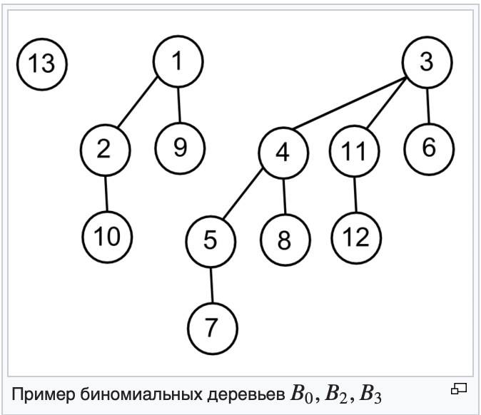

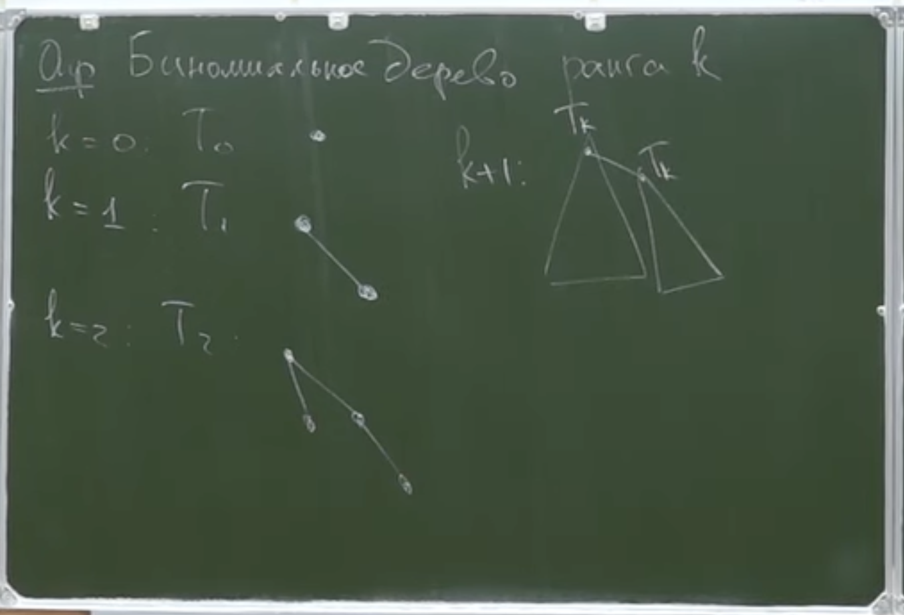

---

#### Сравнительная характеристика

**Преимущества:**

- Эффективное объединение куч за O(log n)
- Амортизированно эффективные операции
- Динамическая структура

**Недостатки:**

- Сложнее реализация
- GetMin требует O(log n) времени
- Большая константа в O-нотации

**Области применения:**

- Приоритетные очереди с частыми операциями слияния
- Алгоритмы на графах (алгоритм Дейкстры)
- Системы с динамическими приоритетами

---

#### Сравнение асимптотик с бинарной кучей

| Операция | Бинарная куча | Биномиальная куча |
|----------|---------------|-------------------|
| **Insert** | O(log n) | O(log n) |
| **ExtractMin** | O(log n) | O(log n) |
| **GetMin** | O(1) | O(log n) |
| **Merge** | O(n) | **O(log n)** |
| **DecreaseKey** | O(log n) | O(log n) |
| **Построение** | O(n) | O(1) |

---

#### Асимптотика операций бинарной кучи

| Операция | Временная сложность | Описание |
|----------|---------------------|----------|
| **Insert** | O(log n) | Создание дерева порядка 0 + объединение |
| **ExtractMin** | O(log n) | Поиск минимума + удаление + объединение |
| **GetMin** | O(log n) | Поиск по корневым узлам |
| **DecreaseKey** | O(log n) | Изменение ключа + просеивание вверх |
| **Delete** | O(log n) | DecreaseKey + ExtractMin |
| **Merge** | O(log n) | Объединение двух куч |
| **Find** | O(n) | Поиск произвольного элемента |

**Можно сделать GetMin за O(1), тогда нужно хранить указатель на min**

---

#### **Пример реализации функции merge для биномиальной кучи**

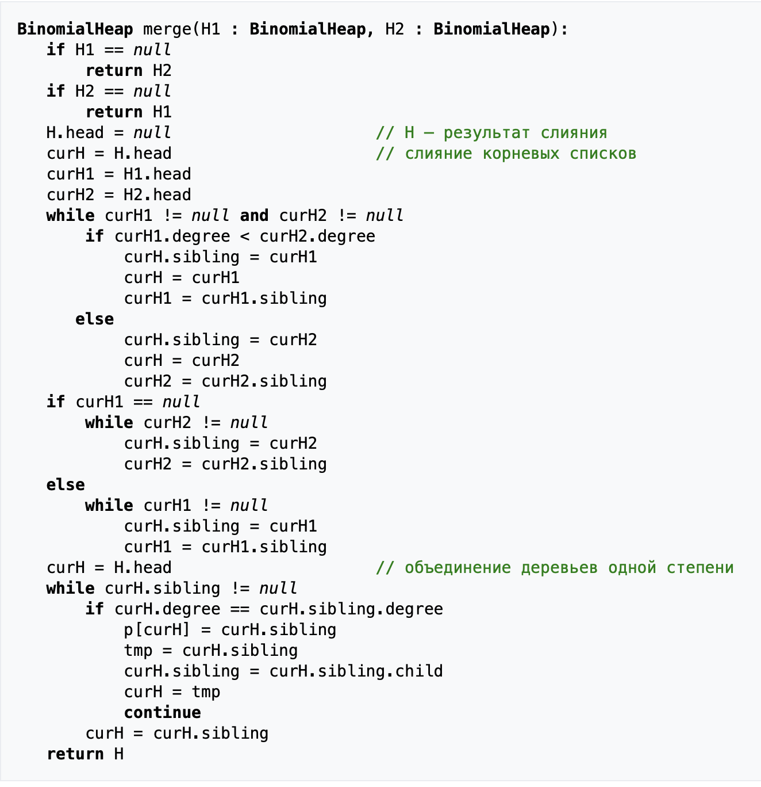

### Фибоначчиевая куча

#### Структура

| Параметр | Значение |
|----------|----------|
| **Структура** | Набор деревьев, удовлетворяющих свойству min-heap |
| **Инвариант min-heap** | Ключ родителя ≤ ключей потомков |
| **Инвариант структуры** | Максимальный порядок любого дерева = O(log n) |
| **Память** | O(n) |
| **Амортизированная сложность** | Большинство операций O(1) |

---

#### **Асимптотика операций**

| Операция | Временная сложность | Описание |
|----------|---------------------|----------|
| **Построение кучи** | O(1) | Создание пустой кучи |
| **Insert** | **O(1)** | Добавление нового дерева в список корней |
| **ExtractMin** | O^*^(log n) | Удаление минимума + консолидация |
| **GetMin** | O(1) | Указатель на минимальный корень |
| **DecreaseKey** | **O^*^(1)** | Изменение ключа + возможный cut |
| **Delete** | O^*^(log n) | DecreaseKey + ExtractMin |
| **Merge** | **O(1)** | Объединение двух куч |
| **Find** | O(n) | Поиск произвольного элемента |

**\*** - **амортизированная(учетная) сложность**

---

#### Сравнительная характеристика

**Преимущества:**

- Амортизированно эффективные операции
- Лучшая производительность для алгоритмов с частыми DecreaseKey
- Быстрое объединение куч

**Недостатки:**

- Сложная реализация
- Большие константы в O-нотации
- Теоретическая эффективность не всегда проявляется на практике

**Ключевые области применения:**

- Алгоритм Дейкстры (O(E + V log V))
- Алгоритм Прима для MST
- Системы с частыми операциями уменьшения ключа

---

## Списки

### Структура

| Параметр | Значение |
|----------|----------|
| **Структура** | Линейная последовательность элементов |
| **Индексация** | Обычно с 0 или с 1 |
| **Порядок** | Сохраняет порядок добавления |
| **Память** | O(n) |
| **Дубликаты** | Разрешены (в большинстве реализаций) |

---

_Введем для нашего удобства такие понятние, как **Head("голова")** и **Tail("хвост")**, которыми будем обозначать **"фальшивые"(или пустые)** первый и последний элемент списка соответственно._

---

### **Односвязный**

В узлах хранятся данные и указатель на следующий элемент в списке.

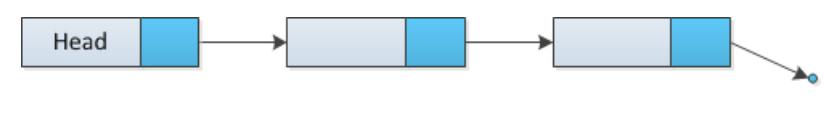

---

### **Двусвязный**

Также хранится указатель на предыдущий элемент списка, благодаря чему становится проще удалять и переставлять элементы.

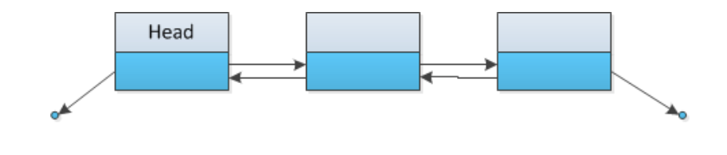

---

### **Циклический**

Первый элемент является следующим для последнего элемента списка.

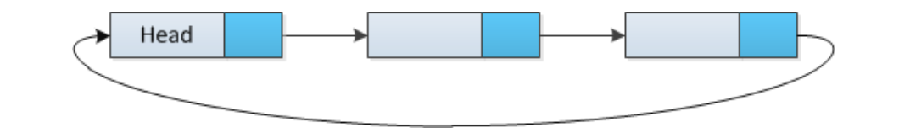

---

### Примененение

1. Биномиальная куча
2. Фибоначчиевая куча
3. Стек
4. Очередь
5. Дек и другие алгоритмы

---

### Основные операции над списками

#### **Вставка**

_Очевиден случай, когда необходимо добавить элемент (newHead) в голову списка. Установим в этом элементе ссылку на старую голову, и обновим указатель на голову._

```cpp
 function insert(Node thatElement):
   thatElement.next = thisElement.next 
   thisElement.next = thatElement
```

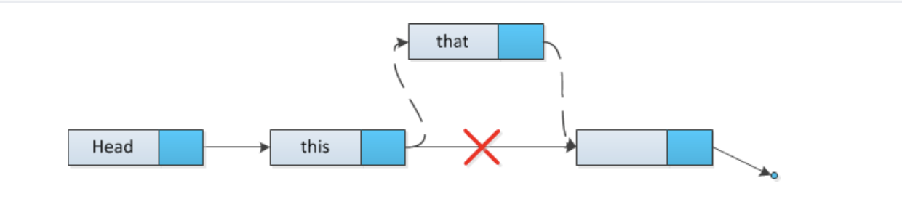

---

#### **Поиск**

_Для того, чтобы найти элемент по значению (value), будем двигаться по списку от головы до конца и сравнивать значение в элементах с искомым. Если элемента в списке нет, то возвращаем NULL._

```cpp
 Node search(int value):
   node = head
   while node != NULL and value != node.value
       node = node.next
   return node
```

---

#### **Удаление**

_Для того, чтобы удалить голову списка, переназначим указатель на голову на второй элемент списка, а голову удалим._

```cpp
 function removeHead():
   if head != NULL
       tmp = head
       head = head.next
       delete tmp
```

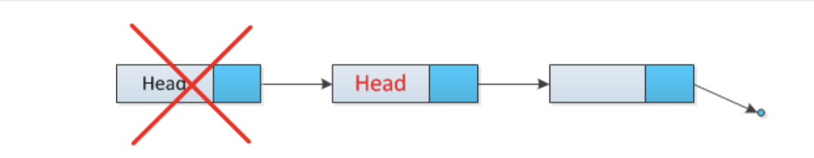

_Удаление элемента после заданного (thisElement) происходит следующим образом: изменим ссылку на следующий элемент на следующий за удаляемым, затем удалим нужный объект._

```cpp
 function removeAfter(Node thisElement):
   if thisElement.next != NULL
       tmp = thisElement.next
       thisElement.next = thisElement.next.next
       delete tmp
```

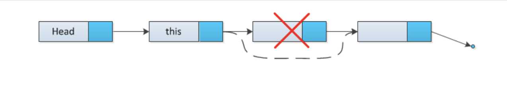

---

### Асимптотика

#### Односвязный список

| Характеристика | Значение |
|----------------|----------|
| **Память** | O(n) |
| **Доступ по индексу** | O(n) |
| **Поиск** | O(n) |
| **Вставка в начало** | **O(1)** |
| **Вставка в конец** | O(n) или O(1) с tail |
| **Удаление из начала** | **O(1)** |

---

#### Двусвязный список

| Характеристика | Значение |
|----------------|----------|
| **Память** | O(n) |
| **Доступ по индексу** | O(n) |
| **Поиск** | O(n) |
| **Вставка в начало/конец** | **O(1)** |
| **Удаление из начала/конца** | **O(1)** |
| **Вставка/удаление в середине** | O(1) после поиска |

---

**Главное преимущество списков - удаление элемента по указателю за O(1)!**

---

### Алгоритмы циклического списка

#### **Поиск цикла в списке**

_Для начала необходимо уметь определять — список циклический или нет. Воспользуемся алгоритмом Флойда "Черепаха и заяц". Пусть за одну итерацию первый указатель (черепаха) переходит к следующему элементу списка, а второй указатель (заяц) на два элемента вперед. Тогда, если эти два указателя встретятся, то цикл найден, если дошли до конца списка, то цикла нет._

```cpp
 boolean hasCycle(Node head):
   tortoise = head
   hare = head
   repeat
     if hare == NULL or hare.next == NULL 
       return false
     tortoise = tortoise.next
     hare = hare.next.next
   until tortoise == hare
   return true
```

_Если цикла не существует, то заяц первым дойдет до конца и функция возвратит false. В другом случае, в тот момент, когда и черепаха и заяц находятся в цикле, расстояние между ними будет сокращаться на 1, что гарантирует их встречу за конечное время._

---

#### **Поиск длины хвоста в списке с циклом**

_Так как для поиска хвоста мы должны знать, что цикл существует, воспользуемся предыдущей функцией и при выходе из неё запомним "момент встречи" зайца и черепахи. Назовем её pointMeeting._

---

##### **Реализация за O(n^2^)**

_Будем последовательно идти от начала цикла и проверять, лежит ли этот элемент на цикле. На каждой итерации запустим от pointMeeting вперёд указатель. Если он окажется в текущем элементе, прежде чем посетит pointMeeting снова, то точку окончания (начала) хвоста нашли._

---

##### **Реализация за O(nlogn)**

_Реализацию, приведенную выше можно улучшить. Для этого воспользуемся бинарным поиском. Сначала проверим голову списка, потом сделаем 2 шага вперёд, потом 4, потом 8 и так далее, пока не окажемся на цикле. Теперь у нас есть две позиции — на левой границе, где мы в хвосте, и на правой — в цикле. Сделаем бинарный поиск уже по этому отрезку и таким образом найдём цикл за O(nlogn)._

---

#### **Задача про обращение списка**

_Для того, чтобы обратить список, необходимо пройти по всем элементам этого списка, и все указатели на следующий элемент заменить на предыдущий. Эта рекурсивная функция принимает указатель на голову списка и предыдущий элемент (при запуске указывать NULL), а возвращает указатель на новую голову списка._

```cpp
 Node reverse(Node current, Node prev):
   if current == NULL
     return prev
   next = current.next
   current.next = prev
   return reverse(next, current)
```

_Алгоритм корректен, поскольку значения элементов в списке не изменяются, а все указатели next изменят свое направление, не нарушив связности самого списка._

---

## Стек и Очередь

### Стек (Stack) - LIFO

#### Операции и определение

_Стек (от англ. stack — стопка) — структура данных, представляющая из себя упорядоченный набор элементов, в которой добавление новых элементов и удаление существующих производится с одного конца, называемого вершиной стека. Притом первым из стека удаляется элемент, который был помещен туда последним, то есть в стеке реализуется стратегия «последним вошел — первым вышел» (last-in, first-out — LIFO). Примером стека в реальной жизни может являться стопка тарелок: когда мы хотим вытащить тарелку, мы должны снять все тарелки выше. Вернемся к описанию операций стека:_

* **empty** — проверка стека на наличие в нем элементов,
* **push (запись в стек)** — операция вставки нового элемента,
* **pop (снятие со стека)** — операция удаления нового элемента.
*  **top** -  получить значение с верхушки стека
  
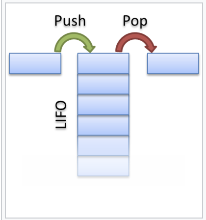

---

| Параметр | Значение |
|----------|----------|
| **Принцип** | LIFO (Last-In-First-Out) |
| **Инвариант** | Последний добавленный элемент извлекается первым |
| **Основные операции** | Push, Pop, Top |
| **Память** | O(n) |

---

#### Асимптотика операций стека

| Операция | Сложность | Описание |
|----------|-----------|----------|
| **Push** | O(1) | Добавление элемента на вершину |
| **Pop** | O(1) | Удаление элемента с вершины |
| **Peek/Top** | O(1) | Просмотр вершины без удаления |
| **IsEmpty** | O(1) | Проверка на пустоту |
| **Search** | O(n) | Поиск элемента в стеке |

---

#### Реализации стека

##### 1. На массиве (статический)

_Перед реализацией стека выделим ключевые поля:__

_𝚜[𝟷…𝚗] — массив, с помощью которого реализуется стек, способный вместить не более n элементов,
𝚜.𝚝𝚘𝚙 — индекс последнего помещенного в стек элемента.
Стек состоит из элементов 𝚜[𝟷…𝚜.𝚝𝚘𝚙], где 𝚜[𝟷] — элемент на дне стека, а 𝚜[𝚜.𝚝𝚘𝚙] — элемент на его вершине. Если 𝚜.𝚝𝚘𝚙=𝟶, то стек не содержит ни одного элемента и является пустым (англ. empty). Протестировать стек на наличие в нем элементов можно с помощью операции — запроса 𝚜𝚝𝚊𝚌𝚔𝙴𝚖𝚙𝚝𝚢. Если элемент снимается с пустого стека, говорят, что он опустошается (англ. underflow), что обычно приводит к ошибке. Если значение 𝚜.𝚝𝚘𝚙 больше 𝚗, то стек переполняется (англ. overflow). (В представленном ниже псевдокоде возможное переполнение во внимание не принимается.)_

Каждую операцию над стеком можно легко реализовать несколькими строками кода:

```cpp
boolean empty():
  return s.top == 0

function push(element : T):
  s.top = s.top + 1
  s[s.top] = element

T pop():
  if empty()
    return error "underflow"
  else 
    s.top = s.top - 1
    return s[s.top + 1]

```

---

##### 2. На динамическом массиве

_Возможна реализация стека на динамическом массиве, в результате чего появляется существенное преимущество над обычной реализацией: при операции push мы никогда не сможем выйти за границы массива, тем самым избежим ошибки исполнения._

_Создадим вектор и определим операции стека на нём. В функции 𝚙𝚞𝚜𝚑 Перед тем, как добавить новый элемент, будем проверять, не нужно ли расширить массив вдвое, а в 𝚙𝚘𝚙, перед тем, как изъять элемент из массива, — не нужно ли вдвое сузить размер вектора. Ниже приведён пример реализации на векторе._

**Ключевые поля:**

𝚜[𝟶…𝚗−𝟷] — старый массив, в котором хранится стек,
𝚗𝚎𝚠𝚂𝚝𝚊𝚌𝚔[𝟶…𝚗𝚎𝚠𝚂𝚒𝚣𝚎] — временный массив, где хранятся элементы после перекопирования,
𝚑𝚎𝚊𝚍 — верхушка стека,
𝚌𝚊𝚙𝚊𝚌𝚒𝚝𝚢 — размер массива.

```cpp
function push(element : T):
  if head == capacity - 1
    T newStack[capacity * 2]
    for i = 0 to capacity - 1
      newStack[i] = s[i]
    s = newStack
    capacity = capacity * 2
  head++
  s[head] = element

T pop():
  temp = s[head]
  head--
  if head < capacity / 4
    T newStack[capacity / 2]
    for i = 0 to capacity / 4 - 1
      newStack[i] = s[i]
    s = newStack
    capacity = capacity / 2
  return temp
```

---

##### 3. На связном списке

_Стек можно реализовать и на списке. Для этого необходимо создать список и операции работы стека на созданном списке. Ниже представлен пример реализации стека на односвязном списке. Стек будем "держать" за голову. Добавляться новые элементы посредством операции 𝚙𝚞𝚜𝚑 будут перед головой, сами при этом становясь новой головой, а элементом для изъятия из стека с помощью 𝚙𝚘𝚙 будет текущая голова. После вызова функции 𝚙𝚞𝚜𝚑 текущая голова уже станет старой и будет являться следующим элементом за добавленным, то есть ссылка на следующий элемент нового элемента будет указывать на старую голову. После вызова функции 𝚙𝚘𝚙 будет получена и возвращена информация, хранящаяся в текущей голове. Сама голова будет изъята из стека, а новой головой станет элемент, который следовал за изъятой головой._

**Заведем конструктор вида ListItem(next : ListItem, data : T)**

**Ключевые поля:**

𝚑𝚎𝚊𝚍.𝚍𝚊𝚝𝚊 — значение в верхушке стека,
𝚑𝚎𝚊𝚍.𝚗𝚎𝚡𝚝 — значение следующее за верхушкой стека.

_В реализации на списке, кроме самих данных, хранятся указатели на следующие элементы, которых столько же, сколько и элементов, то есть, так же 𝚗. Стоит заметить, что стек требует O(n) дополнительной памяти на указатели в списке._

```cpp
function push(element : T):
  head = ListItem(head, element)

T pop():
  data = head.data
  head = head.next
  return data
```

---

#### **Реальный код:**

```cpp
#include <iostream>

// Узел стека
struct StackNode {
    int data;        // Данные
    StackNode* next; // Указатель на следующий узел
};

// Структура стека
struct Stack {
    StackNode* top;  // Вершина стека
};

// Создание пустого стека
void createStack(Stack* stack) {
    stack->top = NULL;
}

// Проверка на пустоту
bool isEmpty(Stack* stack) {
    return stack->top == NULL;
}

// Добавление элемента в стек
void push(Stack* stack, int value) {
    // Создаем новый узел
    StackNode* newNode = new StackNode;
    newNode->data = value;
    
    // Новый узел становится вершиной
    newNode->next = stack->top;
    stack->top = newNode;
}

// Удаление элемента из стека
void pop(Stack* stack) {
    if (isEmpty(stack)) {
        std::cout << "Стек пуст!" << std::endl;
        return;
    }
    
    // Запоминаем текущую вершину
    StackNode* temp = stack->top;
    
    // Перемещаем вершину на следующий элемент
    stack->top = stack->top->next;
    
    // Удаляем старую вершину
    delete temp;
}

// Просмотр вершины стека
int peek(Stack* stack) {
    if (isEmpty(stack)) {
        std::cout << "Стек пуст!" << std::endl;
        return -1; // Возвращаем -1 при ошибке
    }
    return stack->top->data;
}

// Вывод стека
void printStack(Stack* stack) {
    if (isEmpty(stack)) {
        std::cout << "Стек пуст!" << std::endl;
        return;
    }
    
    std::cout << "Стек (сверху вниз): ";
    StackNode* current = stack->top;
    while (current != NULL) {
        std::cout << current->data << " ";
        current = current->next;
    }
    std::cout << std::endl;
}

// Очистка стека
void clearStack(Stack* stack) {
    while (!isEmpty(stack)) {
        pop(stack);
    }
}

// Подсчет размера стека
int getSize(Stack* stack) {
    int count = 0;
    StackNode* current = stack->top;
    while (current != NULL) {
        count++;
        current = current->next;
    }
    return count;
}
```

---

#### Сравнение реализаций стека

| Реализация | Push | Pop | Память | Преимущества | Недостатки |
|------------|------|-----|--------|--------------|------------|
| **Статический массив** | O(1) | O(1) | O(n) | Быстрый, предсказуемая память | Ограниченный размер |
| **Динамический массив** | O(1)* | O(1) | O(n) | Автоматическое расширение | Время переаллокации |
| **Связный список** | O(1) | O(1) | O(n) | Без ограничения размера | Больше памяти на указатели |

*амортизированно

---

### Очередь (Queue) - FIFO

#### Определение и операции

_Очередь (англ. queue)  — это структура данных, добавление и удаление элементов в которой происходит путём операций 𝚙𝚞𝚜𝚑 и 𝚙𝚘𝚙 соответственно. Притом первым из очереди удаляется элемент, который был помещен туда первым, то есть в очереди реализуется принцип «первым вошел — первым вышел» (англ. first-in, first-out — FIFO). У очереди имеется голова (англ. head) и хвост (англ. tail). Когда элемент ставится в очередь, он занимает место в её хвосте. Из очереди всегда выводится элемент, который находится в ее голове. Очередь поддерживает следующие операции:_

1. 𝚎𝚖𝚙𝚝𝚢 — проверка очереди на наличие в ней элементов,
2. 𝚙𝚞𝚜𝚑 (запись в очередь) — операция вставки нового элемента,
3. 𝚙𝚘𝚙 (снятие с очереди) — операция удаления нового элемента,
4. 𝚜𝚒𝚣𝚎 — операция получения количества элементов в очереди.
5. _frant_ - получение значения с начала очереди

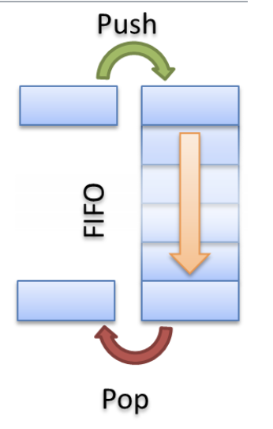

| Параметр | Значение |
|----------|----------|
| **Принцип** | FIFO (First-In-First-Out) |
| **Инвариант** | Первый добавленный элемент извлекается первым |
| **Основные операции** | Enqueue, Dequeue, Front |
| **Память** | O(n) |

---

#### Асимптотика операций очереди

| Операция | Сложность | Описание |
|----------|-----------|----------|
| **Enqueue** | O(1) | Добавление элемента в конец |
| **Dequeue** | O(1) | Удаление элемента из начала |
| **Front** | O(1) | Просмотр первого элемента |
| **IsEmpty** | O(1) | Проверка на пустоту |
| **Search** | O(n) | Поиск элемента в очереди |

---

#### Реализации очереди

##### 1. Циклическая очередь(на массиве)

_Очередь, способную вместить не более 𝚗 элементов, можно реализовать с помощью массива 𝚎𝚕𝚎𝚖𝚎𝚗𝚝𝚜[𝟶…𝚗−𝟷]. Она будет обладать следующими полями:_
𝚑𝚎𝚊𝚍 — голова очереди,
𝚝𝚊𝚒𝚕 — хвост очереди.

```cpp
boolean empty():
  return head == tail

function push(x : T):
  if (size() != n)
    elements[tail] = x
    tail = (tail + 1) % n

T pop():
  if (empty()) 
    return null
  x = elements[head]
  head = (head + 1) % n
  return x

int size()
  if head > tail
    return n - head + tail
  else
    return tail - head
```

---

##### 2. На связном списке

Реализация очереди на **односвязном** списке:

```List
ListItem(data : T, next : ListItem) — конструктор,
𝚡.𝚟𝚊𝚕𝚞𝚎 — поле, в котором хранится значение элемента,
𝚡.𝚗𝚎𝚡𝚝 — указатель на следующий элемент очереди.
```

```cpp
function push(x : T):
  element = tail
  tail = ListItem(x, NULL)
  if size == 0
    head = tail
  else 
    element.next = tail
  size++

T pop(): 
  size--
  element = head
  head = head.next
  return element

boolean empty():
  return head == tail
```

---

##### 3. На двух стеках

_Очередь можно реализовать на двух стеках 𝚕𝚎𝚏𝚝𝚂𝚝𝚊𝚌𝚔 и 𝚛𝚒𝚐𝚑𝚝𝚂𝚝𝚊𝚌𝚔. Поступим следующим образом: 𝚕𝚎𝚏𝚝𝚂𝚝𝚊𝚌𝚔 будем использовать для операции 𝚙𝚞𝚜𝚑, 𝚛𝚒𝚐𝚑𝚝𝚂𝚝𝚊𝚌𝚔 для операции 𝚙𝚘𝚙. При этом, если при попытке извлечения элемента из 𝚛𝚒𝚐𝚑𝚝𝚂𝚝𝚊𝚌𝚔 он оказался пустым, просто перенесем все элементы из 𝚕𝚎𝚏𝚝𝚂𝚝𝚊𝚌𝚔 в него (при этом элементы в 𝚛𝚒𝚐𝚑𝚝𝚂𝚝𝚊𝚌𝚔 получатся уже в обратном порядке, что нам и нужно для извлечения элементов, а 𝚕𝚎𝚏𝚝𝚂𝚝𝚊𝚌𝚔 станет пустым)._

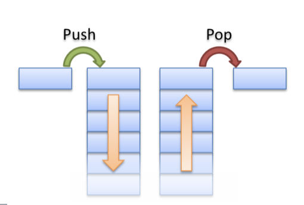

𝚙𝚞𝚜𝚑𝙻𝚎𝚏𝚝 и 𝚙𝚞𝚜𝚑𝚁𝚒𝚐𝚑𝚝 — функции, реализующие операцию 𝚙𝚞𝚜𝚑 для соответствующего стека,
𝚙𝚘𝚙𝙻𝚎𝚏𝚝 и 𝚙𝚘𝚙𝚁𝚒𝚐𝚑𝚝 — аналогично операции 𝚙𝚘𝚙.

```cpp
function push(x : T):
  pushLeft(x)

T pop():
  if not rightStack.empty()
    return popRight() 
  else
    while not leftStack.empty()
      pushRight(popLeft())
    return popRight()
```

---

#### Очередь с минимумом

```
Реализуем на очереди на 2 стеках. Будем работать не с числами, а с парами 
(число, минимум). Каждый раз добавляя что-то в первый стек, запишем в 
минимум минимум из предыдущего элемента и текущего числа.
Затем, каждый раз при извлечении чего-то из очереди будем проверять:

    2-ой стек пустой? 

1. Если да, то перекладываем все элементы из 1 стека в 2-ой и извлекам min
    с верхушки
2. Если нет, то извлекаем min с верхушки
```

**getMin** - O^*^(1)

---

#### Сравнение реализаций очереди

| Реализация | Enqueue | Dequeue | Память | Преимущества | Недостатки |
|------------|---------|---------|--------|--------------|------------|
| **На массиве** | O(1) | O(1) | O(n) | Эффективная память | Ограниченный размер |
| **Связный список** | O(1) | O(1) | O(n) | Без ограничения размера | Больше памяти |
| **Два стека** | O(1) | O^*^(1) | O(n) | Простая реализация | Амортизированная сложность |

---

## Дек (Deque) - двусторонняя очередь

### Определение и операции

| Параметр | Значение |
|----------|----------|
| **Полное название** | Double Ended Queue |
| **Принцип** | Добавление и удаление с обоих концов |
| **Инвариант** | Поддерживает порядок элементов с двусторонним доступом |
| **Память** | O(n) |
| **Гибрид** | Объединяет возможности стека и очереди |

_Дек (от англ. deque — double ended queue) — структура данных, представляющая из себя список элементов, в которой добавление новых элементов и удаление существующих производится с обоих концов. Эта структура поддерживает как FIFO, так и LIFO, поэтому на ней можно реализовать как стек, так и очередь. В первом случае нужно использовать только методы головы или хвоста, во втором — методы push и pop двух разных концов. Дек можно воспринимать как двустороннюю очередь. Он имеет следующие операции:_

𝚎𝚖𝚙𝚝𝚢 — проверка на наличие элементов,
𝚙𝚞𝚜𝚑𝙱𝚊𝚌𝚔 (запись в конец) — операция вставки нового элемента в конец,
𝚙𝚘𝚙𝙱𝚊𝚌𝚔 (снятие с конца) — операция удаления конечного элемента,
𝚙𝚞𝚜𝚑𝙵𝚛𝚘𝚗𝚝 (запись в начало) — операция вставки нового элемента в начало,
𝚙𝚘𝚙𝙵𝚛𝚘𝚗𝚝 (снятие с начала) — операция удаления начального элемента.

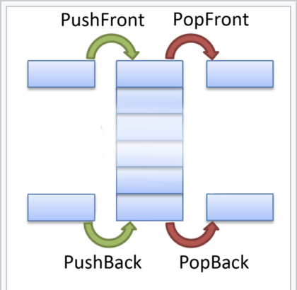

---

| Операция | Сложность | Описание |
|----------|-----------|----------|
| **𝚙𝚞𝚜𝚑𝙵𝚛𝚘𝚗𝚝** | O(1) | Добавление в начало |
| **𝚙𝚞𝚜𝚑𝙱𝚊𝚌𝚔** | O(1) | Добавление в конец |
| **𝚙𝚘𝚙𝙵𝚛𝚘𝚗𝚝** | O(1) | Удаление из начала |
| **𝚙𝚘𝚙𝙱𝚊𝚌𝚔** | O(1) | Удаление с конца |

---

### Реализации дека

#### 1. На двусвязном списке

**Ключевые поля:**

ListItem(data : T, next : ListItem, prev : ListItem) — конструктор,
𝚝𝚊𝚒𝚕 — ссылка на хвост,
𝚑𝚎𝚊𝚍 — ссылка на голову.

---

_Дек очень просто реализуется на двусвязном списке. Он состоит из элементов 𝚑𝚎𝚊𝚍…𝚝𝚊𝚒𝚕. Элементы всегда добавляются либо в 𝚝𝚊𝚒𝚕.𝚙𝚛𝚎𝚟, либо в 𝚑𝚎𝚊𝚍.𝚗𝚎𝚡𝚝. В данной реализации не учитывается изъятие из пустого дека._

```cpp
function initialize():
  head = ListItem(null, null, null)
  tail = ListItem(null, null, head)
  head.next = tail

function pushBack(x : T):
  head = ListItem(x, head, null)
  head.next.prev = head

T popBack():
  data = head.data
  head = head.next
  return data

function pushFront(x : T):
  tail = ListItem(x, null, tail)
  tail.prev.next = tail

T popFront():
  data = tail.data
  tail = tail.prev
  return data

```

---

#### 2. Цикличсекий дек (массив)

_Во всех циклических реализациях изначально присвоены следующие значения 𝚑𝚎𝚊𝚍=𝟶 и 𝚝𝚊𝚒𝚕=𝟶. Ключевые поля:_

_𝚍[𝟶…𝚗−𝟷] — массив, с помощью которого реализуется дек, способный вместить не более n элементов,
𝚑𝚎𝚊𝚍 — индекс головы дека,
𝚝𝚊𝚒𝚕 — индекс хвоста.
Дек состоит из элементов 𝚍[𝚑𝚎𝚊𝚍…𝚝𝚊𝚒𝚕−𝟷] или 𝚍[𝟶…𝚝𝚊𝚒𝚕−𝟷] и 𝚍[𝚑𝚎𝚊𝚍…𝚗−𝟷]. Всего он способен вместить не более n элементов. В данной реализации учитывается переполнение и правильно обрабатывается изъятие из пустого дека. Недостатком является константная длина массива, хранящего элементы. Все операции выполняются за O(1)._

```cpp
function pushBack(x : T):
  if (head == (tail + 1) % n)
    return error "overflow"
  d[tail] = x
  tail = (tail + 1) % n

T popBack():
  if (empty()) 
    return error "underflow" 
  tail = (tail - 1 + n) % n
  return d[tail]

function pushFront(x : T):
  if (head == (tail + 1) % n)
    return error "overflow"
  head = (head - 1 + n) % n
  d[head] = x

T popFront():
  if (empty()) 
    return error "underflow" 
  T ret = d[head]
  head = (head + 1) % n
  return ret
```

---

### Сравнение реализаций дека

| Реализация | pushFront | pushBack | popFront | popBack | Память | Преимущества |
|------------|----------|---------|-------------|------------|--------|--------------|
| **Двусвязный список** | O(1) | O(1) | O(1) | O(1) | O(n) | Простая реализация |
| **Кольцевой буфер** | O(1) | O(1) | O(1) | O(1) | O(n) | Эффективная память |
| **Динамический массив** | O(n) | O^*^(1) | O(n) | O(1) | O(n) | - |

---

## Бинарный поиск

### Структура и операции

| Параметр | Значение |
|----------|----------|
| **Сложность** | O(log n) |
| **Память** | O(1) |
| **Условие** | Отсортированный массив |
| **Тип** | Алгоритм "разделяй и властвуй" |
| **Стабильность** | Не применимо |

---

### Сравнение вариантов бинарного поиска

| Тип поиска | Возвращает | Условие | Сложность | Применение |
|------------|------------|---------|-----------|------------|
| **Классический** | bool | arr[mid] == target | O(log n) | Проверка наличия |
| **Lower Bound** | index | arr[mid] ≥ target | O(log n) | Первое вхождение |
| **Upper Bound** | index | arr[mid] > target | O(log n) | За последним вхождением |
| **По ответу** | value | predicate(mid) | O(log R) | Оптимизационные задачи |
| **Вещественный** | double | right-left > ε | O(log(1/ε)) | Математические задачи |

---

### Реализации и их особенности

#### 1. Классический бинарный поиск

```cpp
bool binary_search(int arr[], int n, int x) {
    int l = 0;
    r = n - 1;
    while (l <= r) {
        int mid = l + (r - l) / 2;
        if (arr[mid] == x) return true;
        else if (arr[mid] < x) l = mid + 1;
        else r = mid - 1;
    }
    return false;
}
```

---

#### 2. Lower Bound

```cpp
int lower_bound_bs(int arr[], int n, int x) {
    int l = 0;
    int r = n;
    while (l < r) {
        int mid = l + (r - l) / 2;
        if (arr[mid] < x) {
            l = mid + 1;
        } else {
            r = mid;
        }
    }
    return l;
}
```

---

#### 3. БинПоиск по ответу

_Нам нужно пройтись обычным бинарным поиском по значениям, которые потенциально могут являться ответом, тогда если по условию выбрать правильную версию бин поиска и границы, то задача решается перебором за logn_

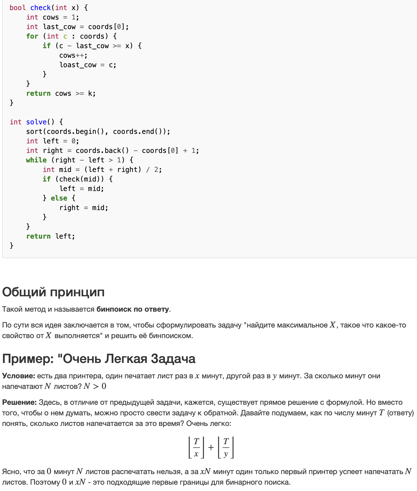

---

#### 4. Вещественный БинПоиск

##### Определение

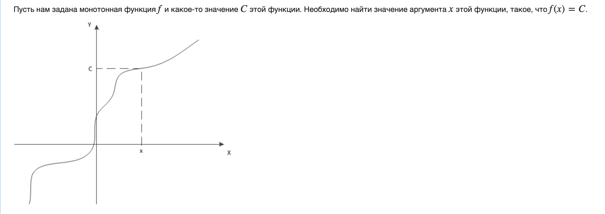

_Применим идею двоичного поиска. Выберем такие границы, где значение функции точно больше и точно меньше заданного значения. Выберем значение в середине этого отрезка. Если оно меньше, чем заданное, то сместим левую границу в середину отрезка. В противном случае сместим правую границу. Далее повторим процесс сужения границ. Встает вопрос, когда остановиться. Есть несколько способов сделать это._

---

##### **Способы закончить поиск**

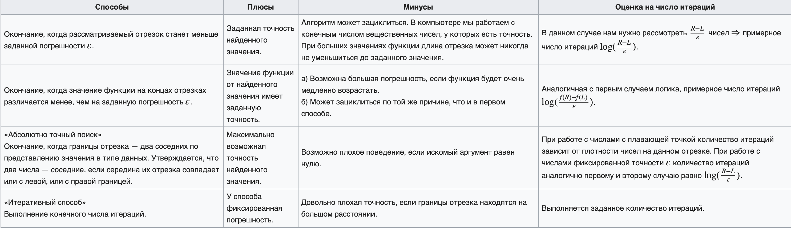

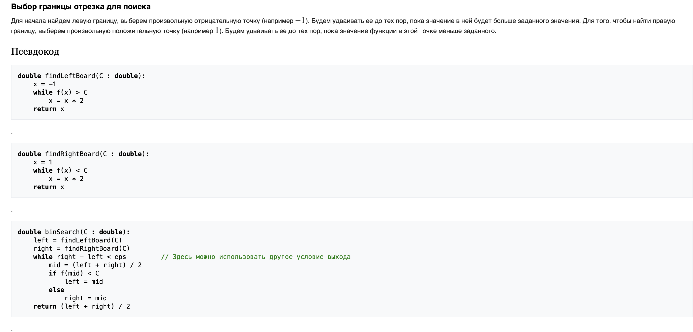

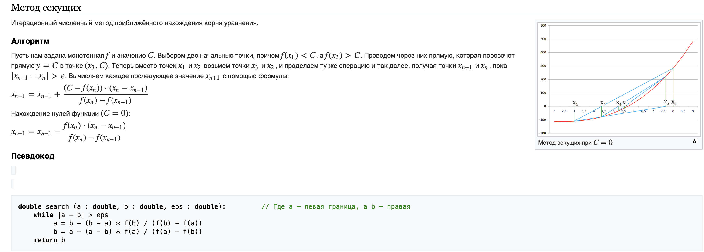

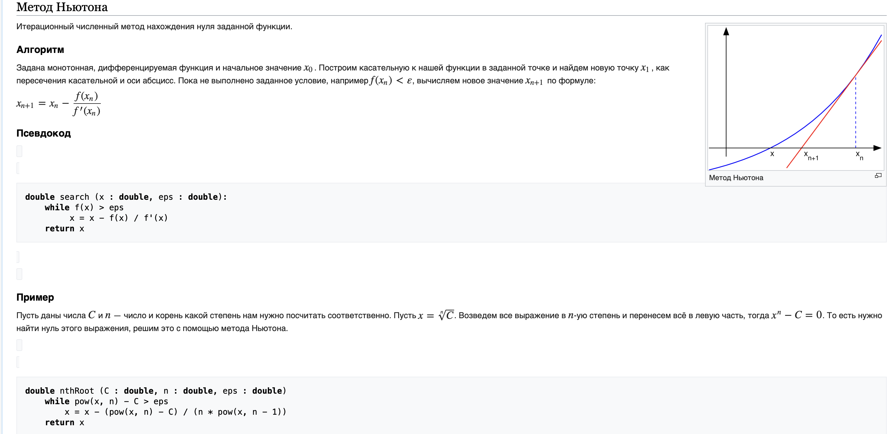

---

### Пространственная сложность

| Реализация | Память | Рекурсия | Stack |
|------------|--------|----------|-------|
| **Итеративная** | O(1) | Нет | O(1) |
| **Рекурсивная** | O(log n) | Да | O(log n) |

---

### Инварианты алгоритма

| Инвариант | Описание |
|-----------|----------|
| **Отсортированность** | Массив должен быть отсортирован |
| **Инвариант цикла** | Если target существует, то он в [left, right] |
| **Монотонность** | Условие поиска должно быть монотонным |

---

## Динамическое программирование

### Кузнечик

**Наипростейшая задача, похожая на префиксные суммы:**

```cpp
int main() {
    int n;
    std::cin >> n;
    int arr[n];
    for (int i = 0; i < n; i++) {
        std::cin >> arr[i];
    }

    int dp[n + 1];
    dp[0] = 0;
    dp[1] = arr[0];

    for (int i = 2; i < n + 1; i++) {
        dp[i] = std::max(dp[i - 1], dp[i - 2]) + arr[i - 1];
    }
    std::cout << dp[n];
}
```

**Асимптотика: $O(n)$**

---

### Рюкзак

**N - количество предметов, W - вместимость рюкзака, w_i - вес i-ой вещи, p_i - стоимость i-ой вещи. Хотим собрать рюкзак большей стоимости с весом не более чем W. Иначе хотим найти b_i, i=1..N, b_i - 0/1: sum(b_i * p_i) - max, sum(b_i * w_i) <= W A(k,s) - максимальная стоимость предметов, которые можно уложить в рюкзак вместимости s, если можно использовать только первые k предметов**

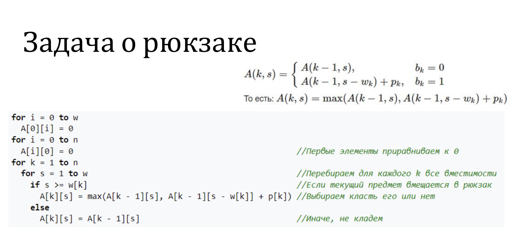

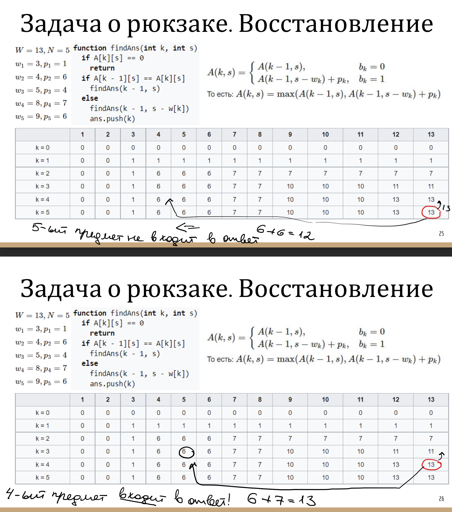

**Асимптотика: $O(WN)$ по времени и по памяти.**
**Можно развернуть динамику в обратную сторону(от цены, а не от веса), тогда асимптотика $O(CN)$.**

---

### НВП

#### Определение

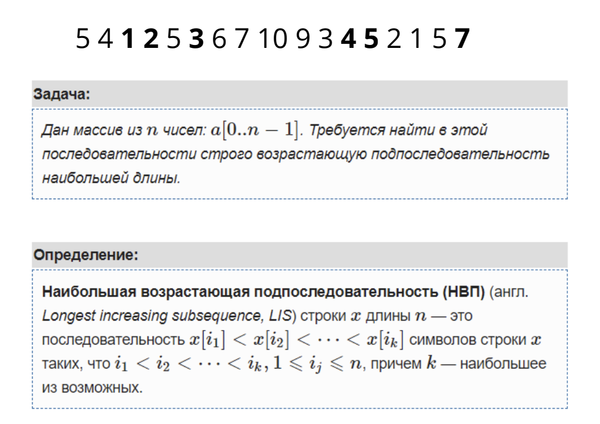

---

#### Реализация

##### O(n^2^)

_В каждом i-ом эл-те массива храним максимальную длину НВП, заканчивающейся в i-ой позиции_

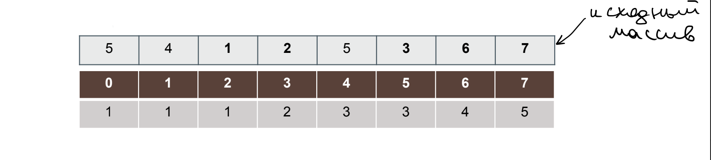

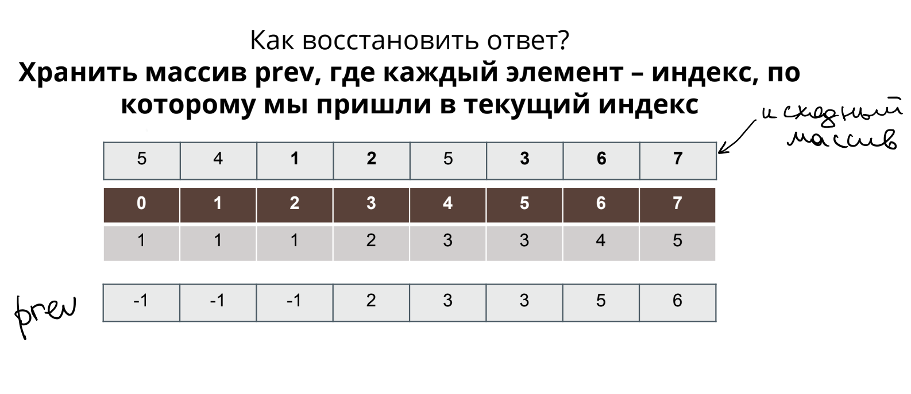

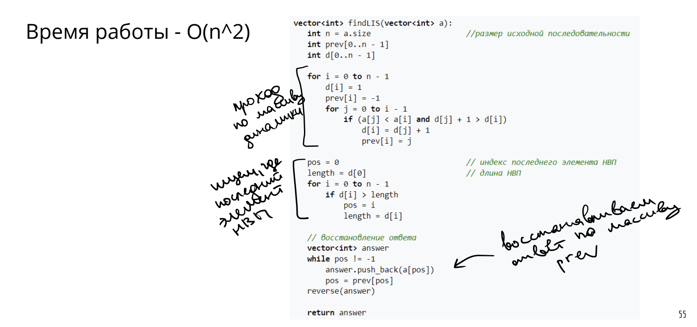

---

##### O(nlogn)

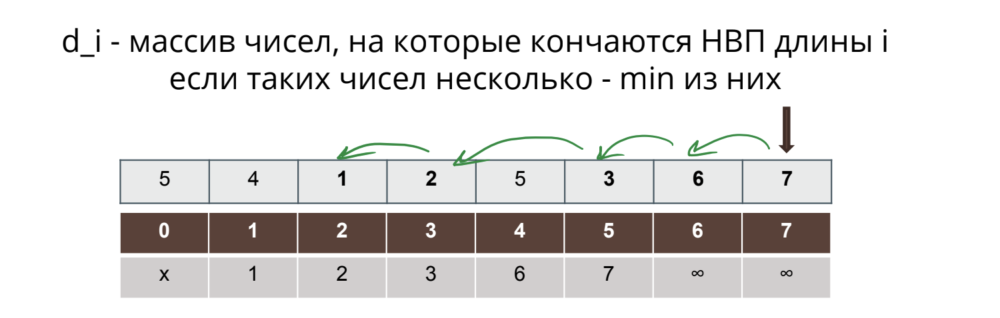

**Ответ восстанавливается также, как и в реализации за n^2^**

```cpp
int bin_search(int64_t arr[], int n, int x) {
    int l = -1;
    int r = n;
    while (l < r - 1) {
        int mid = l + (r - l) / 2;
        if (arr[mid] < x) {
            l = mid;
        } else {
            r = mid;
        }
    }
    return r;
}

int main() {
    int n;
    std::cin >> n;

    int64_t arr[n];
    for (int i = 0; i < n; i++) {
        std::cin >> arr[i];
    }

    int64_t dp[n];
    for (int i = 0; i < n; i++) {
        dp[i] = 100'000'000'000;
    }

    int len = 0;
    for (int i = 0; i < n; i++) {
        int j = bin_search(dp, n, arr[i]);
        dp[j] = arr[i];
        if (j + 1 > len) {
            len = j + 1;
        }
    }
    std::cout << len;
}
```

---

### Редакционное расстояние

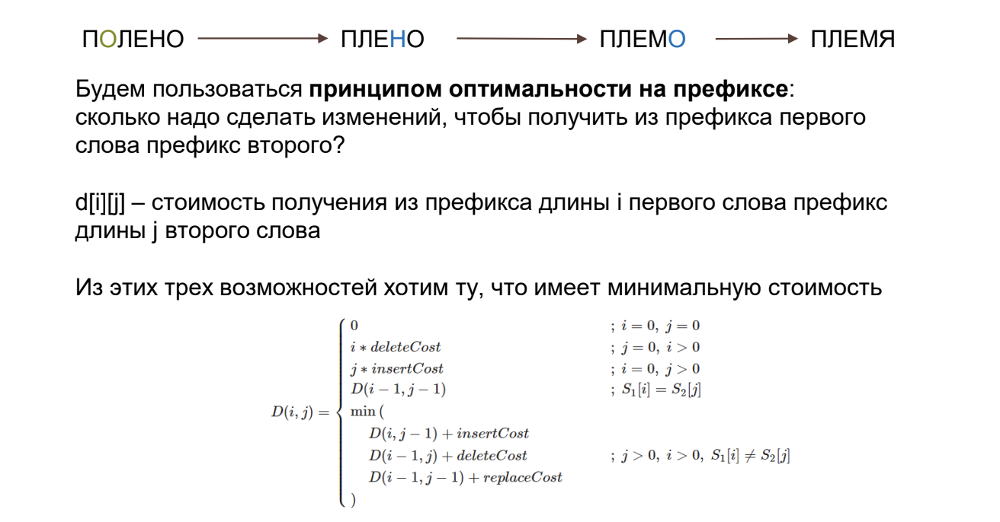

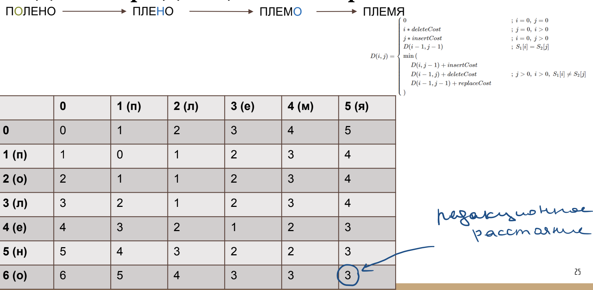

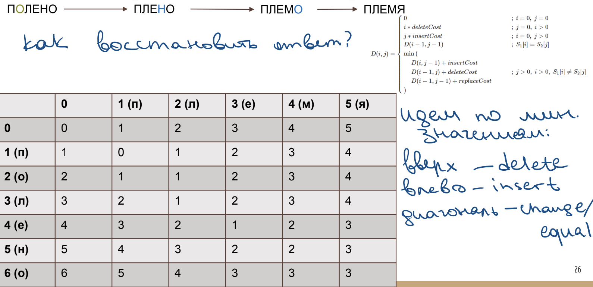

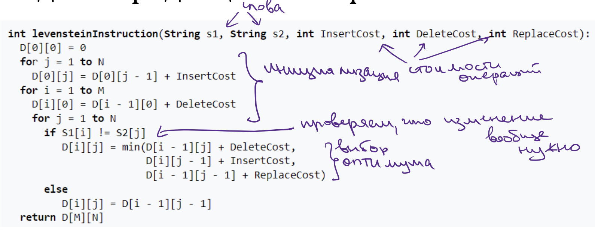

**Асимптотика: $O(|s1|*|s_2|)$**

---

### Битовые маски и профиль

#### Прямой профиль

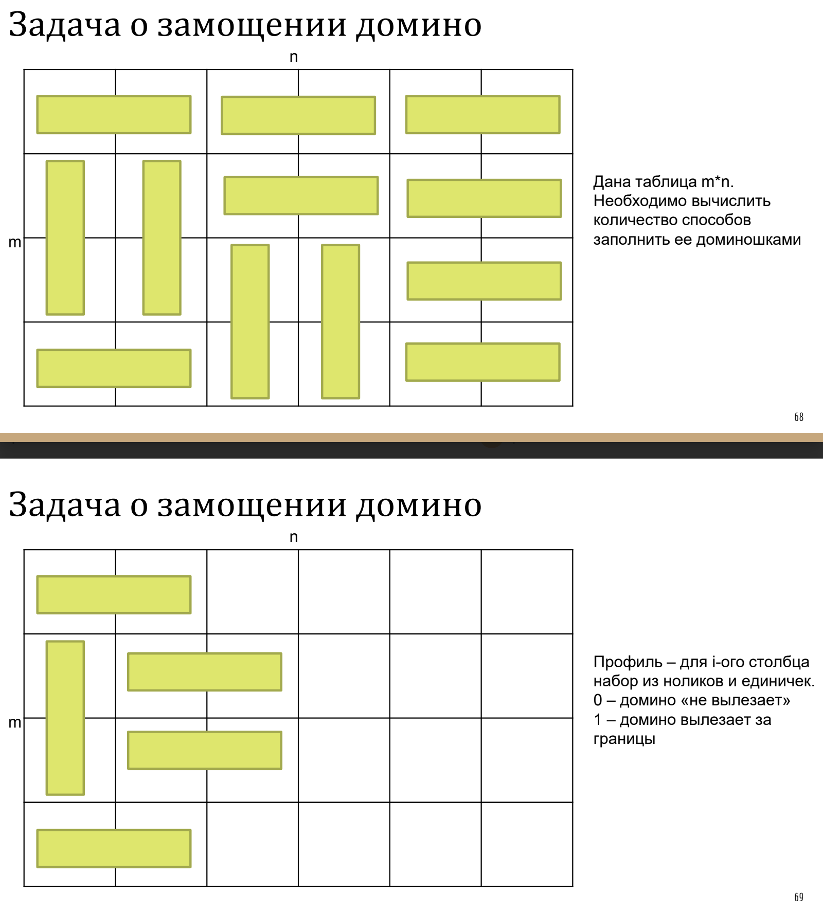

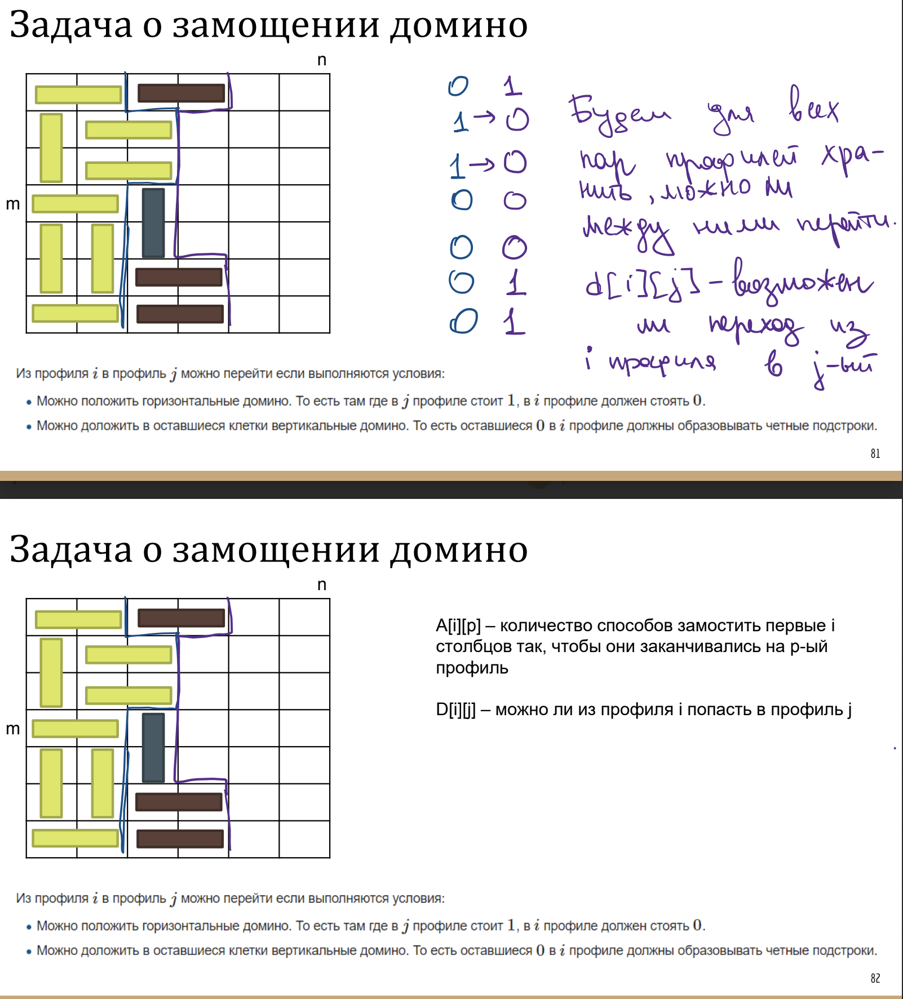

```cpp
bool check(size_t i, size_t j, int W) {
    if (i & j) return false;
    
    size_t combined = i | j;
    int cnt = 0;
    
    for (int k = 0; k < W; k++) {
        if ((combined & (1 << k)) == 0) {
            cnt++;
        } else {
            if (cnt % 2 != 0) return false;
            cnt = 0;
        }
    }
    return (cnt % 2 == 0);
}

int main() {

    int W, H;
    std::cin >> W >> H;
    int64_t dp[1 << W][1 << W];
    for (size_t i = 0; i < (1 << W); i++) {
        for (size_t j = 0; j < (1 << W); j++) {
            if (check(i, j, W)) {
                dp[i][j] = 1;
            } else {
                dp[i][j] = 0;
            }
        }
    }

    int64_t arr[H + 1][1 << W];
    for (int k = 0; k < H + 1; k++) {
        for (size_t i = 0; i < (1 << W); i++) {
            arr[k][i] = 0;
        }
    }
    arr[0][0] = 1;
    for (int k = 1; k < H + 1; k++) {
        for (size_t i = 0; i < (1 << W); i++) {
            for (size_t j = 0; j < (1 << W); j++) {
                arr[k][i] += arr[k - 1][j] * dp[j][i];
            }
        }
    }
    
    std::cout << arr[H][0];
}
```

**Асимптотика: O(4^n^m)**

---

#### Изломанный профиль

**Введем профиль такой, что будем проходить по всем строкам в каждом столбце так, что излом профиля располагается в позиции (i, j). Будем перебирать маску дл такого профиля.**

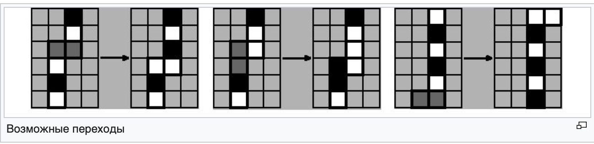

**Асимптотика: O(2^n^mn)**


---

### ДП на подотрезках(задача о расстановке знаков)

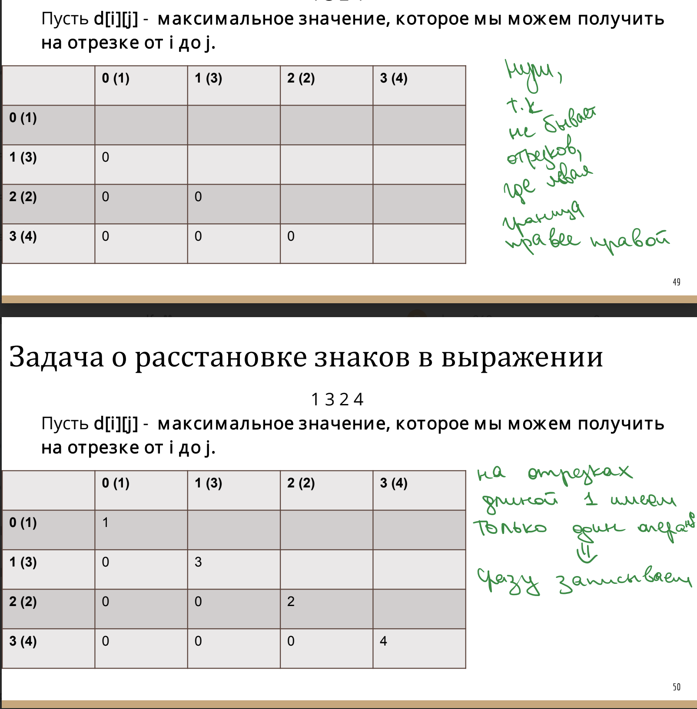

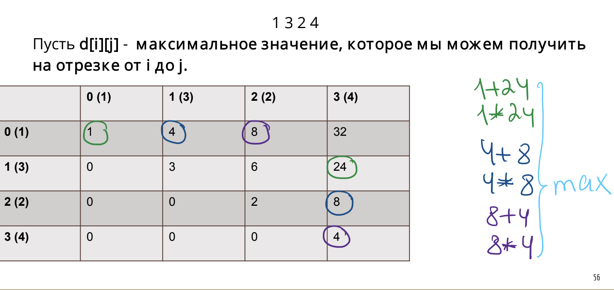

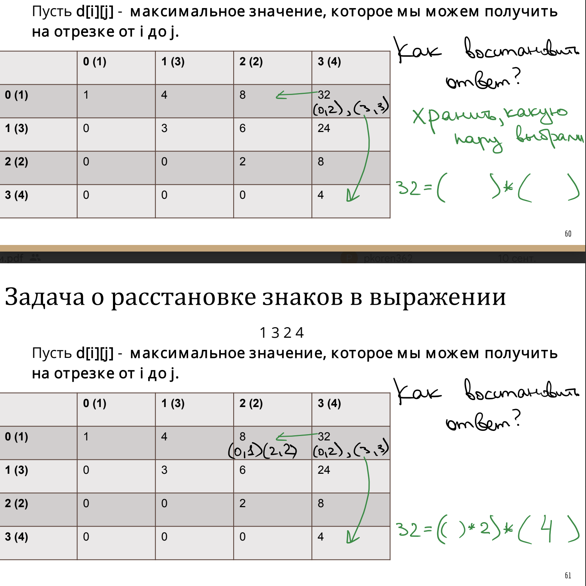

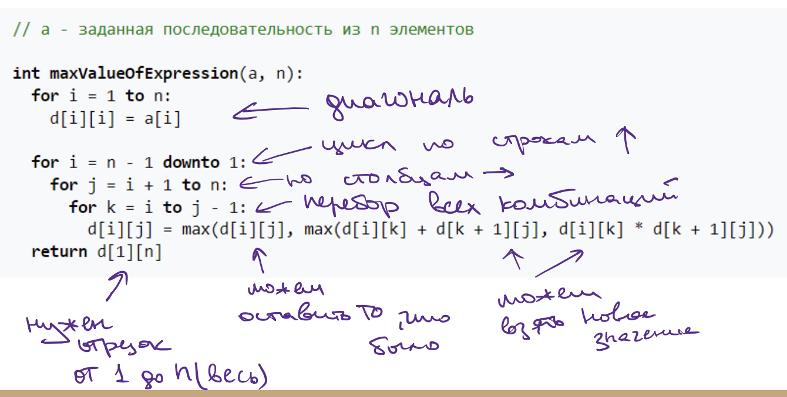

**Асимптотика: O(n^3^)**

---

## Персистентность

### Определение

**Персистентность** _- это св-во структуры хранить свои предыдцщие версии и изменения._

---

###  Уровни персистентности

- **Частичная (англ. partial)** - _к каждой версии можно делать запросы, но изменять можно только последнюю версию структуры данных._
- **Полная (англ. full)** - _можно менять не только последнюю, но и любую версию структур данных, также к любой версии можно делать запросы._
- **Конфлюэнтная (англ. confluent)** - _позволяют объединять две структуры данных в одну (деревья поиска, которые можно сливать)._
- **Функциональная (англ. functional)** - _полностью персистентны по определению, так как в них запрещаются уничтожающие присваивания, т.е. любой переменной значение может быть присвоено только один раз и изменять значения переменных нельзя._

---

### Способы преобразования структур данных в персистентные

#### Полное копирование

**Полное копирование** - _самый неэффектиынй способ, когда при любой операции изменения полностью копируется структура данных и в получившуюся новую копию вносятся изменения._

---

#### Копирование пути

**Копирование пути** - _значительно более эффективный способ сделать структуру персистентной. Чаще всего применяется в структурам, представляющим деревья._

**Рассмотрим на примере ДО:**

_Для построения персистентного дерева отрезков из n элементов необходимо применить n раз операцию добавления элемента к последней версии дерева. Для того, чтобы добавить новый элемент к k-ой версии дерева, необходимо проверить, является ли оно полным бинарным. Если да, то создадим новый корень, левым сыном сделаем roots[k]. Иначе, сделаем копию корня исходной версии. Добавим корень в конец массива корней. Далее, спускаясь от корня к первому свободному листу, будем создавать несуществующие узлы и клонировать существующие. После этого в новой ветке необходимо обновить значение функции и некоторые указатели дочерних элементов. Поэтому, возвращаясь из рекурсии, будем менять один указатель на только что созданную или скопированную вершину, а также обновим значение функции, для которой строилось дерево. После этой операции в дереве появится новая версия, содержащая вставленный элемент._

_Для того, чтобы изменить элемент в персистентном дереве отрезков, необходимо сделать следующие действия: спустимся в дереве от корня нужной версии до требуемого элемента, скопируем его, изменим значение, и, поднимаясь по дереву, будем клонировать узлы. При этом необходимо менять указатель на одного из детей на узел, созданный при предыдущем клонировании. После копирования корня, добавим новый корень в конец массива корней._

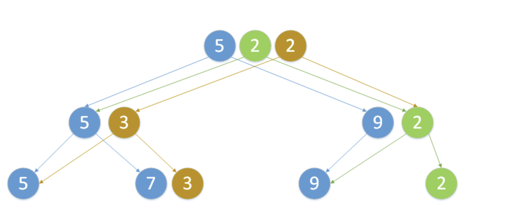

_Здесь изображено персистентное дерево отрезков с операцией минимум, в котором изначально было 3 вершины. Сперва к нему была добавлена вершина со значением 2, а потом изменена вершина со значением 7. Цвет ребер и вершин соответствует времени их появления. Синий цвет элементов означает, что они были изначально, зеленый - что они появились после добавления, а оранжевый - что они появились после изменения элемента._

**На каждую версию такого персистентного ДО уйдет около O(logn) памяти, т.к. храним тольку одну измененную ветку и указатели на предыдущую неизмененнную версию дерева**

**На примере персистентного стека:**
_Будем хранить массив указателей на текующую голову стека(верхний эл-т). После каждого изменения(pop/push) добавляем в этот массив обновленную голову, тогда если мы захотим вернуться к какой-либо версии, то нам нужно будет всего лишь взять указатель на голову в этой версии, а от него уже можно будет получить весь стек этой версии_

---

#### Хранения изменений

**Хранение изменений(или метод "толстых" узлов)** - _похоже на полное копирование, но более эффективно, т.к. мы храним не всю структуру, а только изменяющиеся от версии к версии части._

_На примере **персистентного массива** мы будем после каждой операции **update** сохранять пару **(version, new_value)**  в массив измменений каждого элемента(pos)._

```cpp
Для массива:
[2, 6 ,7, 0] -> [2, 13, 7, 0] -> [2, 13, 3, 0] -> [2, 8, 3, 0]

pos 0: [] -> [] -> [] -> []
pos 1: [] -> [(1, 13)] -> [(1, 13), (3, 8)]
pos 2: [] -> [] -> [(2, 3)] -> [(2, 3)]
pos 3: [] -> [] -> [] -> []
```

---

## Деревья

### Вариации деревьев

#### Дерево отрезков

##### Построение за O(n) и асимптотики

_Выделяют два основных способа построения дерева отрезков: **построение снизу и построение сверху**. При построении снизу алгоритм поднимается от листьев к корню (Просто начинаем заполнять элементы массива t от большего индекса к меньшему, таким образом при заполнении элемента i его дети 2i+1 и 2i+2 уже будут заполнены, и мы с легкостью посчитаем бинарную операцию от них), а при построении сверху спускается от корня к листьям. Особенные изменения появляются в реализации запросов к таким деревьям отрезков._

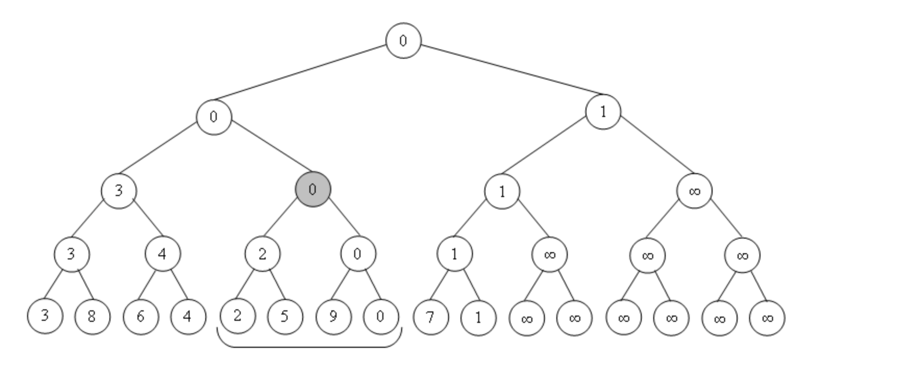

| Операция | Временная сложность | Пространственная сложность (структура) |
|----------|-------------------|----------------------------------------|
| Построение (build) | O(n) | O(n) |
| Запрос (query) | O(log n) | O(1)* |
| Обновление точки (point update) | O(log n) | O(1)* |
| Обновление отрезка (lazy propagation) | O(log n) | O(n) |
| Обновление отрезка (без lazy) | O(n) | O(n) |

**Примечания:**

1. **Простраственная сложность O(n)** для хранения дерева — это **4n** в худшем случае для рекурсивной реализации на массиве. Итеративная реализация может уменьшить до **2n** (или ~2n).
2. **O(1)** по памяти для запроса и точечного обновления — дополнительная память, не считая хранения самого дерева (т.е. стек вызовов или локальные переменные).
3. **Lazy propagation** позволяет делать обновление на отрезке за O(log n), но увеличивает затраты по памяти вдвое (обычно ещё массив размера 4n).
4. Для **персистентного дерева отрезков** временные сложности те же O(log n), но пространственная O(log n) на операцию (или O(m log n) для m версий).

**O(4n)** — стандартный запас для рекурсивного дерева на массиве (хотя можно ужать до 2n, но с потерей простоты кода).

---

###### Построение сверху

```cpp
Реализация построения сверху:

function treeBuild(T a[], int i, int tl, int tr):  // мы находимся в вершине с номером i, который отвечает за полуинтервал [tl, tr) 
    if tr - tl == 1
        t[i] = a[tl]
    else
        tm = (tl + tr) / 2                            // середина отрезка
        treeBuild(a, 2 * i + 1, tl, tm)
        treeBuild(a, 2 * i + 2, tm, tr)
        t[i] = t[2 * i + 1] ∘ t[2 * i + 2]
```

---

###### Построение снизу

```cpp
Реализация построения снизу:

function treeBuild(T a[]):
    for i = 0 to n - 1
        t[n - 1 + i] = a[i]
    for i = n - 2 downto 0
        t[i] = t[2 * i + 1] ∘ t[2 * i + 2]
```

---

##### Update

**1-итерация**

```cpp
void update(i, L, R, pos, val) {
    t[i] += val
    if (L == R) return
    M = (L + R) / 2
    if (pos <= M) {
        update(2i, L, M, pos, val)
    } else {
        update(2i + 1, M + 1, R, pos, val)
    }
}
```

---

##### GetSum

**1-итерация**

```cpp
Сверху 

int getsum(v, L, R, l, r) {
    if ([L, R] ⊂ [l, r]) return t[v]
    ans = 0
    if (l <= M) {
        ans += getsum(2v, L, M, l, r)
    }
    if (r > M) {
        ans += getsum(2v + 1, M + 1, R, l, r)
    }
    return ans
}
```

---

```cpp
Снизу

int query(left: int, right: int) {
    leftRes = neutral
    rightRes = neutral
    while left < right
        if left mod 2 == 0
            leftRes = leftRes ∘ data[left]
        left = left div 2 
        if right mod 2 == 1
            rightRes = data[right] ∘ rightRes
        right = right div 2 - 1
    if left == right  
        leftRes = leftRes ∘ data[left]
    return leftRes ∘ rightRes
}
```

---

##### Бинарный спуск

_В задаче, где необходимо найти при известной левой границе l минимальную правую границу r такую, что на этом подотрезке сумма >= s, можно применить **бинарный спуск**._

**Бинарный спуск = БинПоиск + ДО**

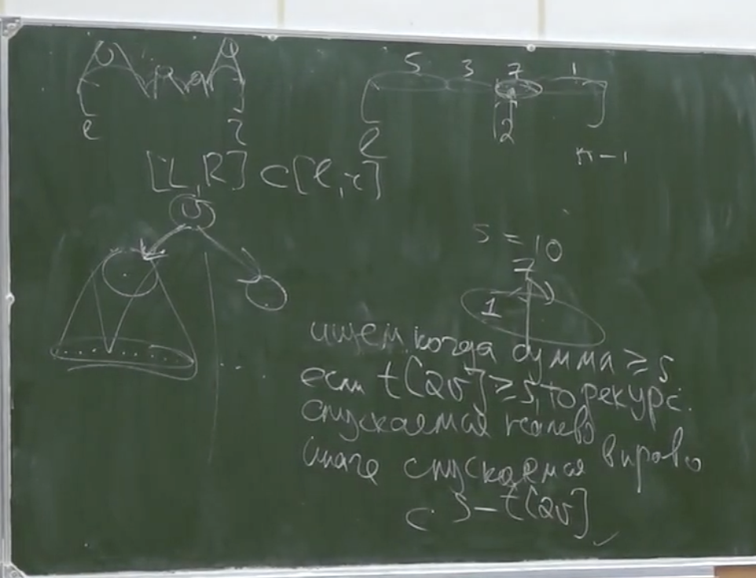

**_Алгоритм:_**

- Рекурсивно идем в левое поддерево
- Если сумма в нем >= s - пробуем спускаться ниже.
- Иначе сохраняем это поддерево, вычитаем из s сумму в поддереве.
- Аналогично идем в правое поддерево, ищем в нем новое s

**Асимптотика: O(logn)**_, т.к. алгоритм раздваивается на каждом шаге_

---

##### Отложенные операции. Групповое обновление

_Рассмотрим в общем виде реализацию массовой операции на отрезке. Пусть необходимо отвечать на запросы относительно операции ⊕, а запрос массового обновления идет по операции ⊙._

_Для эффективной реализации будем использовать описанную выше структуру — несогласованные поддеревья. В каждой вершине, помимо непосредственно результата выполнения операции ⊕, храним несогласованность — величина, с которой нужно выполнить операцию ⊙ для всех элементов текущего отрезка. Тем самым мы сможем обрабатывать запрос массового обновления на любом подотрезке эффективно, вместо того чтобы изменять все O(N) значений. Как известно из определения несогласованных поддеревьев, в текущий момент времени не в каждой вершине дерева хранится истинное значение, однако когда мы обращаемся к текущему элементу мы работаем с верными данными. Это обеспечивается "проталкиванием" несогласованности детям (процедура push) при каждом обращений к текущей вершине. При этом после обращения к вершине необходимо пересчитать значение по операции ⊕, так как значение в детях могло измениться._

**В каждом нижеприведенном псевдокоде в узлах дерева хранятся структуры из четырех полей:**

- 𝚕𝚎𝚏𝚝 — левая граница полуинтервала, за который "отвечает" текущая вершина.
- 𝚛𝚒𝚐𝚑𝚝 — правая граница этого полуинтервала.
- 𝚊𝚗𝚜 — результат на отрезке по операции ⊕.
- 𝚍 — несогласованность.

---

`push`
_**"Проталкивание" несогласованности детям.** Необходимо выполнять как только идет рекурсивный запуск от текущей вершины к её детям. Нужно это для того, чтобы в детях в момент обработки были корректные данные._

```cpp
void push(int node) {                                               // node - текущая вершина 
       tree[2 * node + 1].d = tree[2 * node + 1].d ⊙ tree[node].d;
       tree[2 * node + 2].d = tree[2 * node + 2].d ⊙ tree[node].d;
       tree[node].d = ⊥;                                           // Нейтральный элемент 
}
```

---

`update`
_**Процедура обновления на отрезке.** Данная процедура выполняет разбиение текущего отрезка на подотрезки и обновление в них несогласованности. **Очень важно выполнить push как только идет рекурсивный вызов от детей**, чтобы избежать некорректной обработки в детях. И так как значение в детях могло измениться, то необходимо выполнить обновление ответа по операции ⊕ на текущем отрезке._

```cpp
void update(int node, int a, int b, T val) {
    // val - значение, которое поступило в качестве параметра на запрос, a и b - границы запроса 
       l = tree[node].left;
       r = tree[node].right; 
       if  [l, r) ∩ [a, b) == ∅
           return;
       if [l, r) ⊂ [a, b)
           tree[node].d = tree[node].d ⊙ val;
           return;

       push(node); 
   // Обновление детей 
       update(2 * node + 1, a, b, val);
       update(2 * node + 2, a, b, val);
    // Пересчет значения на текущем отрезке 
       tree[node].ans = (tree[2 * node + 1].ans
       ⊙ tree[2 * node + 1].d) ⊕ (tree[2 * node + 2].ans 
       ⊙ tree[2 * node + 2].d);
}
```

---

`query`
_**Получение ответа по операции ⊕.** Отличие от операции обновления лишь в том, что **для каждого отрезка разбиения необходимо не обновить несогласованность, а сложить по операции ⊕ с текущим ответом истинное значение на отрезке** (то есть обновить значение в каждой вершине после update и пересчитать query для подотрезка)._

```cpp
T query(int node, int a, int b) {
       l = tree[node].left;
       r = tree[node].right; 
       if  [l, r ) ∩ [a, b) == ∅
           return ⊥;
       if [l, r) ⊂ [a, b)
           return tree[node].ans ⊙ tree[node].d;
       push(node);   
       T ans = query(node * 2 + 1, a, b) ⊕  
                query(node * 2 + 2, a, b));
       tree[node].ans = (tree[2 * node + 1].ans ⊙ tree[2 * node + 1].d) ⊕ 
                         (tree[2 * node + 2].ans ⊙ tree[2 * node + 2].d);
       return ans;
}
```

---

##### Fractional Cascading

_Это способ оптимизации БинПоиска при спуске по дереву. Еслив нашем ДО нам необходимо мерджить массивы на подотрезках, то в течение мерджа для каждого эл-та можно сохранить указатель на наибольшие элементы <= его в каждом из массивов. Тогда после таких операций, не придется для каждой вершины дерева запускать БинПоиск:_ 

**$O(log^2n) \rightarrow O(logn)$.**

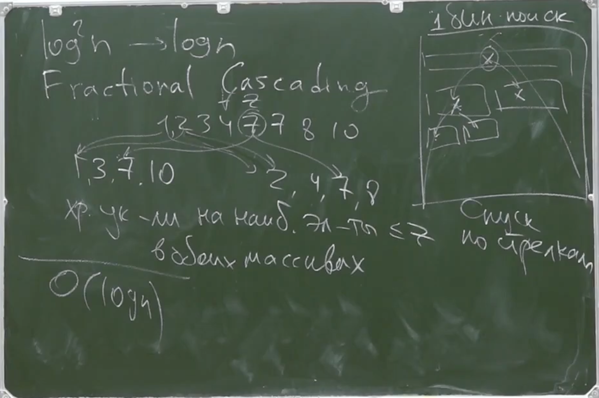

---

##### Динамическое ДО(неявное)

###### Определение и асимптотика

_Вместо того, чтобы хранить массив на 4n эл-ов, храним дерево в виде списка, где в каждой ноде указатель на 2 сыновей, границы подотрезка и значение на нем._
_Каждый раз при запросе update строим только ту ветку, по которой хотим пройти, обновляем на ней значения. Ту часть, которую не используем - не строим и считаем, что она заполнена нулями(нейтральными эл-ми). Далее обращаясь к дереву, если необзодимая ветка уже есть - используем ее, если нет, то строим необходимую. Таким образом, экономим на памяти_

**Асимптотика остается такой же:**
`O(logn) + O(logn) (рекурсивное выделение памяти) = O(logn)`

---

###### Оффлайн запросы. Сжатие координат

_Предположим, что заранее знаем все запросы к нашей структуре. Выделим оттуда все запросы, в которых происходили изменения структуры и отбросим все остальные. Теперь переприсвоим нашим выделенным запросам новые координаты(< исходыных), отсортируем и построим на них обычное ДО._
_Таким образом, мы отбрасываем существование запросов, которые ничего не меняли(т.к. знаем все запросы заранее и что они не поменяются) и уменьшаем кол-во необходимой памяти_

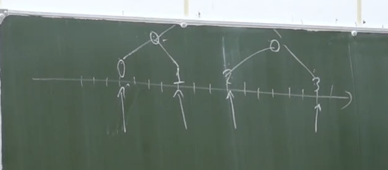

**Асимптотика:**
`O(qlog(q)) - по времени,`
`O(q) - по памяти,`
`где q - кол-во запросов`

---

#### Дерево Фенвика

##### Определение

**Дерево Фе́нвика (англ. Binary indexed tree)** — _структура данных, требующая O(n) памяти и позволяющая эффективно (за O(logn)) выполнять следующие операции:_

- _изменять значение любого элемента в массиве_
- _выполнять некоторую ассоциативную, коммутативную, обратимую операцию ∘ на отрезке [i,j]._

_Пусть дан массив A=[a_0,a_1,...,a_n−1]. Деревом Фенвика будем называть массив T из n элементов: Ti=∑k=F(i)iak, где i=0..n−1 и F(i) — некоторая функция, от выбора которой зависит время работы операций над деревом. Рассмотрим функцию, позволяющую делать операции вставки и изменения элемента за время O(logn). Она задается простой формулой: **F(i)=i&(i+1)**, где & — это операция побитового логического AND. При AND числа и его значения, увеличенного на единицу, мы получаем это число без последних подряд идущих единиц._

- _**Для пересчёта дерева Фенвика** при изменении величины a_k необходимо **изменить элементы дерева T_i** для индексов i, для которых верно неравенство **F(i)⩽k⩽i**._

- _Все такие i, для которых меняется T_i при изменении a_k, можно найти по формуле **i_next=i_prev | (i_prev+1)**, где ∣ — это операция побитового логического OR._

---

##### Алгоритмы

###### Update

```cpp
function update(i, d):
   while i < N
       t[i] += d
       i = i | (i + 1)
```

---

###### Set

**Часто можно встретить задачу, где требуется заменить значение элемента a_i на x. Заметим, что если вычислить разность x и a_i, то можно свести эту задачу к операции прибавления d к a_i:**

```cpp
function set(i, x):
   d = x - a[i]
   a[i] = x
   update(i, d)
```

---

###### Build

**Построение дерева можно осуществить, исходя из его описания. Но можно быстрее, если использовать функцию update для каждого элемента массива A. Тогда мы получим время работы O(nlogn).**

```cpp
function build():
   for i = 0 to N - 1
       update(i, a[i])
```

---

###### GetPrefixSum

**Получение префиксных сумм на отрезке:**

```cpp
int sum(i):
   result = 0
   while i >= 0
       result += t[i]
       i = f(i) - 1
   return result
```

---

##### Асимптотика

| Параметр | Значение / Описание |
| :--- | :--- |
| **Инвариант** | Структура на основе бинарного представления индексов. Каждый элемент `tree[i]` хранит сумму элементов исходного массива на отрезке `[i - g(i) + 1, i]`, где `g(i) = i & (-i)` — младший ненулевой бит (операция `i & -i`). |
| **Назначение** | Эффективное вычисление **префиксных сумм** и **точечных обновлений** для мультимножества чисел. |
| **Пространственная сложность** | `O(n)` (использует массив размера `n+1`, индексация с 1) |
| **Инициализация (построение)** | `O(n log n)` (n раз `update`) |
| **Обновление элемента (point update)** | `O(log n)` |
| **Запрос префиксной суммы (prefix sum)** | `O(log n)` |
| **Запрос суммы на отрезке [l, r]** | `O(log n)` (как `sum(r) - sum(l-1)`) |
| **Точечный запрос значения a[i]** | `O(log n)` (через разность префиксных сумм) или `O(1)` если хранить исходный массив отдельно |
| **Обновление диапазона, точечный запрос** | Реализуется через **два дерева Фенвика** (разностный массив) |

---

**Ключевые особенности:**

1. **Проще реализации**, чем дерево отрезков, особенно для задач на префиксные суммы.
2. **Операция на отрезке, для которой строится дерево Фенвика, должна быть обратимой**, а это значит, что минимум (как и максимум) на отрезке это дерево считать не может, в отличие от дерева отрезков. Но если нам требуется найти минимум на префиксе, то дерево Фенвика справится с этой задачей. Такое дерево Фенвика поддерживает операцию уменьшения элементов массива. Пересчёт минимума в дереве происходит быстрее, чем обновление массива минимумов на префиксе.
3. **Константа** в асимптотике очень мала благодаря простым битовым операциям.
4. **Неявная структура** — не требует хранения дерева в явном виде (узлов и связей), только массив.

---

#### BST

##### Описание и асимптотика

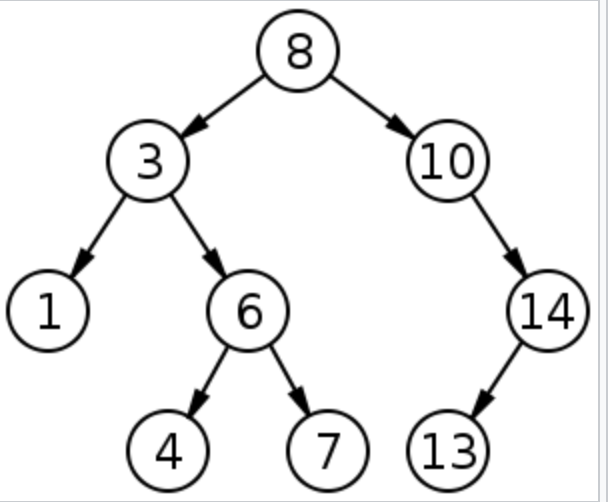

| Параметр | Значение / Описание |
| :--- | :--- |
| **Инвариант** | Для каждого узла: все ключи в левом поддереве < ключ узла < все ключи в правом поддереве. |
| **Пространственная сложность** | `O(n)` |
| **Вставка (в среднем)** | `O(H)` |
| **Вставка (в худшем)** | `O(n)` |
| **Удаление (в среднем)** | `O(log H)` |
| **Удаление (в худшем)** | `O(n)` |
| **Поиск (в среднем)** | `O(log H)` |
| **Поиск (в худшем)** | `O(n)` |
| **Построение из n элементов** | `O(n log H)` в среднем, `O(n²)` в худшем |

**H - высота дерева**

---

##### Структура узла

```cpp
struct Node {
    T key; //значение в вершине
    Node* left; // левый потомок
    Node* right; // правый потомок
    Node* parent; // указатель на родителя(необязателен)
};
```

---

##### Операции

###### Поиск эл-та

```cpp
Node* search(Node* root, int x) {
    if (!root || root->value == x) return root;
    if (root->value > x) {
        return search(root->left, x);
    } else {
        return search(root->right, x);
    }
}
```

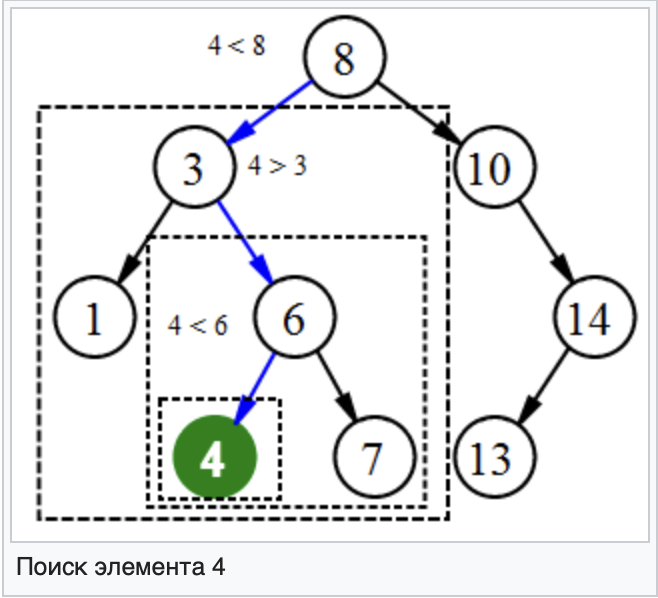

---

###### Поиск минимума/максимума в дереве

_Здесь представлена итеративная версия,_ _можно использовать рекурсию_

```cpp
Node* find_min(Node* root) {
   if (!root) return root;
   while (root->left) {
       root = root->left;
   }
   return root;
}
// Абсолютно симметрично
Node* find_max(Node* root) {
   if (!root) return root;
   while (root->right) {
       root = root->right;
   }
   return root;
}
```

---

###### Поиск следующего/предыдущего

_Здесь не используется информация о родителе,_ _но можно переписать с ее помощью_

```cpp
Node* next(Node* root, int x) {
    Node* cur = root;
    Node* suc = nullptr;
    while (cur) {
        if (cur->value > x) {
            suc = cur;
            cur = cur->left;
        } else {
            cur = cur->right;
        }
    }
    return suc;
}

Node* prev(Node* root, int x) {
    Node* cur = root;
    Node* suc = nullptr;
    while (cur) {
        if (cur->value < x) {
            suc = cur;
            cur = cur->right;
        } else {
            cur = cur->left;
        }
    }
    return suc;
}
```

---

###### Insert

```cpp
void insert(Node*& root, int x) {
    if (!root) {
        root = new Node;
        root->value = x;
        return;
    } else if (x < root->value) {
        insert(root->left, x);
    } else if (x > root->value) {
        insert(root->right, x);
    }
}
```

---

###### Erase

_Удаление элемента бьется на 3 случая:_

- 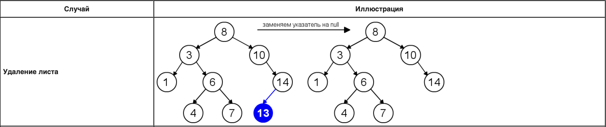
- 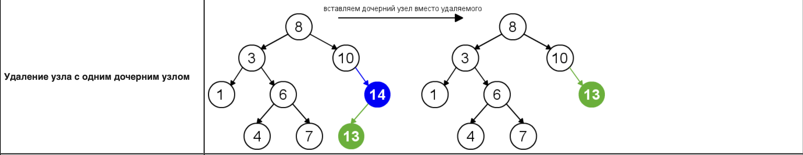
- 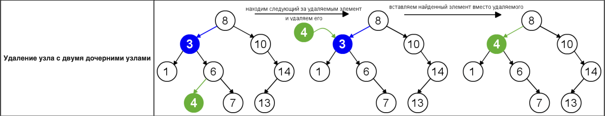

```cpp
Node* erase(Node* root, const int& x) {
    if (!root) {
        return root;
    }
    if (x < root->value) {
        root->left = erase(root->left, x);
    } else if (x > root->value) {
        root->right = erase(root->right, x);
    } else {
        Node* l = root->left;
        Node* r = root->right;
        if (!r) {
            delete root;
            return l;
        } else if (!l) {
            delete root;
            return r;
        } else {
            Node* min = find_min(r);
            root->value = min->value;
            root->right  = erase(root->right, min->value);
        }
    }
    return root;
}
```

---

#### AVL дерево

##### Описание и асимптотика

**AVL дерево** - _вариация наивного BST, в котором за счет балансирования дерева получается свести асимптотику от **O(log H) до честного O(log n)**, т.е. избежать бамбука._

| Параметр | Значение / Описание |
| :--- | :--- |
| **Инвариант** | BST-инвариант и  **\|h(L)−h(R)\| ⩽1** для каждой вершины |
| **Пространственная сложность** | `O(n)` |
| **Вставка** | `O(log n)` |
| **Удаление** | `O(log n)` |
| **Поиск** | `O(log n)` |
| **Балансировка (повороты)** | `O(1)` на узел |
| **Построение из n элементов** | `O(n log n)` |

##### Структура узла

```cpp
struct Node {
    T key; //значение в вершине
    Node* left; // левый потомок
    Node* right; // правый потомок
    Node* parent; // указатель на родителя(необязателен)
    int height = 0;
};
```

##### Балансировка

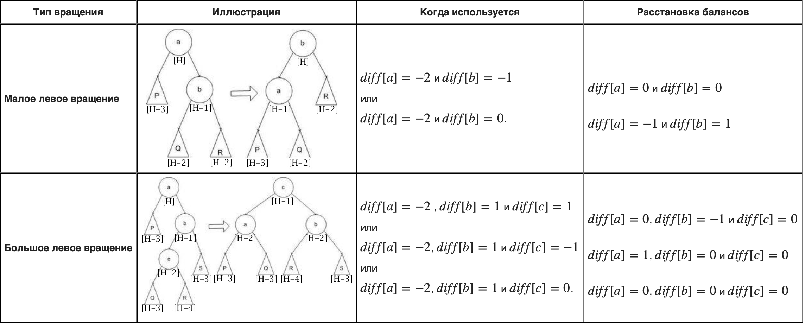

```cpp
int get_height(const Node* root) { // посмотреть высоту дерева
    return root ? root->height : 0;
}

int get_balance(const Node* root) { // считаем h(L)−h(R) для двух поддеревьев
    return root ? get_height(root->left) - get_height(root->right) : 0;
}

void fix_height(Node*& root) { // обновление поля height в узле
    if (root) {
        int h1 = get_height(root->left);
        int h2 = get_height(root->right);
        root->height = std::max(h1, h2) + 1;
    }
}

Node* rotate_l(Node* root) { // малый левый поворот
    Node* b = root->right;
    root->right = b->left;
    b->left = root;
    fix_height(root);
    fix_height(b);
    return b;
}

Node* rotate_r(Node* root) { // малый правый поворот
    Node* b = root->left;
    root->left = b->right;
    b->right = root;
    fix_height(root);
    fix_height(b);
    return b;
}

Node* balance(Node* root) { // общая ф-ия для вращений
    if (!root) return root;
    fix_height(root);

    // Большой левый поворот
    if (get_balance(root) == -2) {
        if (get_balance(root->right) > 0) {
            root->right = rotate_r(root->right);
        }
        return rotate_l(root);
    }

    // Большой правый поворот
    if (get_balance(root) == 2) {
        if (get_balance(root->left) < 0) {
            root->left = rotate_l(root->left);
        }
        return rotate_r(root);
    }
    return root;
}
```

---

##### Операции

_Операции в AVL **полностью совпадают** с наивным **BST**, только после каждой операции,
меняющей дерево(insert/erase) **вызываем balance**, чтобы поддержать инвариант._

_Операции `merge и split` можно реализовать на AVL дереве, но это неоправданно **сложно и ресурсозатратно**._

---

#### Splay дерево

##### Определение и асимптотика

**Splay-дерево** — _это двоичное дерево поиска. Оно позволяет находить быстрее те данные, которые использовались недавно, т.е. поднимает последний "потроганный" эл-т в корень._

| Параметр | Значение / Описание |
| :--- | :--- |
| **Инвариант** | BST-инвариант |
| **Пространственная сложность** | O(n) |
| **insert** | O^*^(log n) |
| **erase** | O^*^(log n) |
| **find** | O^*^(log n) |
| **splay** | O^*^(log n) |
| **merge** | O^*^(log n) |
| **split** | O^*^(log n) |
| **Построение** | O^*^(nlog n) |

_Операция **splay** делится на 3 случая различных поворотов:_

- zig
- zigzag
- zigzig

**_Ключевые особенности:_**

- _Splay(x) выполняется за **O(h)**, где h - длина пути от x до корня._

- _Доказывается, что splay(x) работает за **O^*^(logn)**._

- _**В среднем и худшем случаях** операции splay-дерева работают за **O^*^(logn)**, а в **лучшем** за **O(1)**._

- _В отличие от ранее разобранного AVL дерева в splay-дереве удобно реализуются операции **merge/split**._

---

##### Splay

###### zig

`Если p — корень дерева с сыном x, то совершаем один поворот вокруг ребра (x,p), делая x корнем дерева. Данный случай является крайним и выполняется только один раз в конце, если изначальная глубина x была нечетной.`

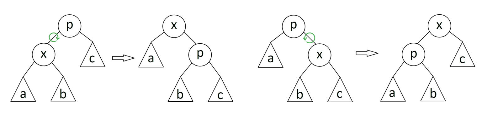

---

###### zigzag

`Если p — не корень дерева и x — левый ребенок, а p — правый, или наоборот, то делаем поворот вокруг ребра (x,p), а затем поворот нового ребра (x,g), где g — бывший родитель p.`

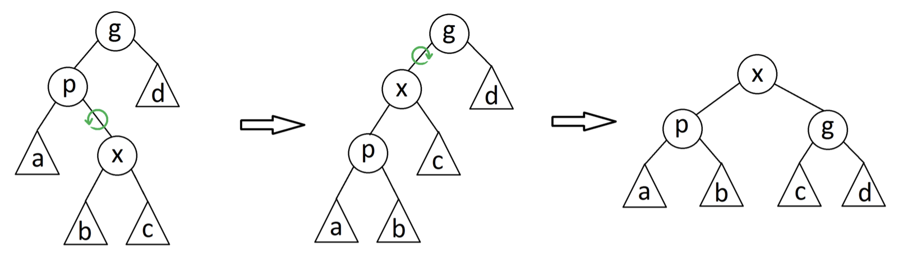

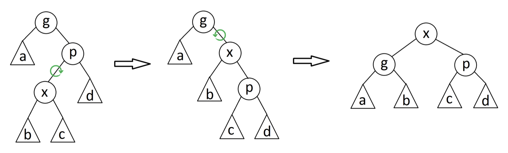

---

###### zigzig

`Если p — не корень дерева, а x и p — оба левые или оба правые дети, то делаем поворот ребра (p,g), где g отец p, а затем поворот ребра (x,p).`

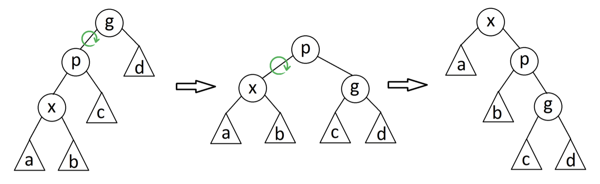

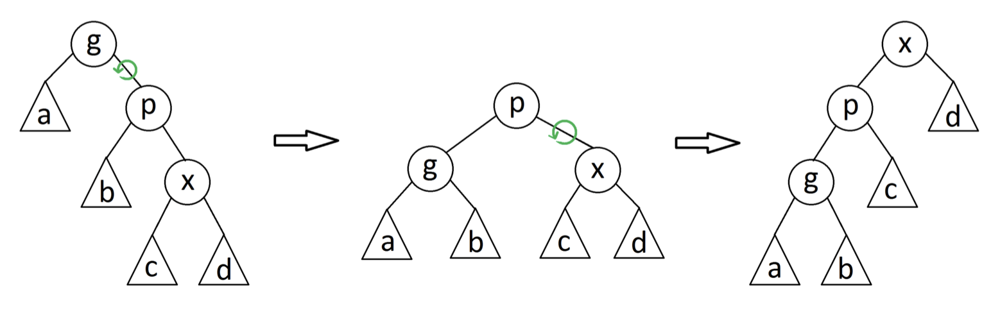

---

###### Реализация splay

`Помимо указателей на левого и правого сыновей и ключа, будем хранить в каждой ноде указатель на родителя.`

```cpp
Node p(Node v): // получить родителя
  return v.parent

Node g(Node v): // получить родителя родителя
  return p(p(v))


void rotate_left(Node v): // левый поворот как в AVL
  Node p = p(v)
  Node r = v.right
  if (p != null)
    if (p.left == v)
      p.left = r
    else
      p.right = r
  Node tmp = r.left
  r.left = v
  v.right = tmp
  p(v) = r
  p(r) = p
  if (v.right != null)
    p(v.right) = v

// Симметрично правый поворот
// Необходимы для реализации zig, zigzig, zigzag


//Реализация splay:
void splay(Node v):
  while (p(v) != null)
    if (v == p(v).left) // если элемент - левый сын
      if (g(v) == null) // zig
        rotate_right(p(v))
      else if (p(v) == g(v).left) // zigzig
        rotate_right(g(v))
        rotate_right(p(v))
      else
        rotate_right(p(v)) //zigzag
        rotate_left(p(v))
    else // если элемент правый сын
      if (g(v) == null) // zig
        rotate_left(p(v))
      else if (p(v) == g(v).right) //zigzig
        rotate_left(g(v))
        rotate_left(p(v))
      else
        rotate_left(p(v)) // zigzag
        rotate_right(p(v))
```

---

##### Операции

###### merge

_Пусть **есть 2 splay-дерева T1 и T2**, таких что **все ключи в T1 меньше, чем все ключи в T2**. **Найдем наибольший(самый правый)** эл-т x в T1 и запустим **splay(x)**. Теперь, т.к. x наибольший в T1, у корня нет правого ребенка, тогда **подвесим в качестве правого ребенка T2**. Нетрудно заметить, что инвариант дерева поиска сохранится._

---

###### split

_Пусть мы **хотим разбить дерево по ключу k**. **Найдем  x - максимальный эл-т <= k** и запустим **splay(x)**. Теперь **в левом поддререве L все эл-ты <= x <= k**, а в **правом поддереве R все эл-ты > x > k**. Значит **возвращаем L и R**, что и требовалось._

---

###### find

_Стоит заметить, что операции работает точно так же, **как в наивном BST**, отличие состоит лишь в **вызове** операции **splay** после запроса find._

---

###### insert

_Сделаем **split(tree, x)**, разбив изначально дерево на 2 поддерева(в поддереве L все ключи < x, в R > x). Заметим, что **инвариант дерева поиска сохраняется** в таком случае, так что **подвесим L и R в качестве левого и правого детей x**._

---

###### erase

_Запустим **splay(x)**, тем самым **подняв x в корень**, теперь **удалим x** и сделаем **merge от его детей**._

---

#### Неявное дерево поиска

_Является **вариацией любого** дерева поиска, позволяющей работать с деревом как с массивом, т.е. выполянть следующие операции:_

- insert
- update
- delete
- find
- получить значение по индексу

_Будем в **каждом узле** хранить **количество эл-ов в его поддереве**, включая его самого. Тогда утверждается, что можно **однозначно восстановить индексы** эл-ов в исходном "массиве"._

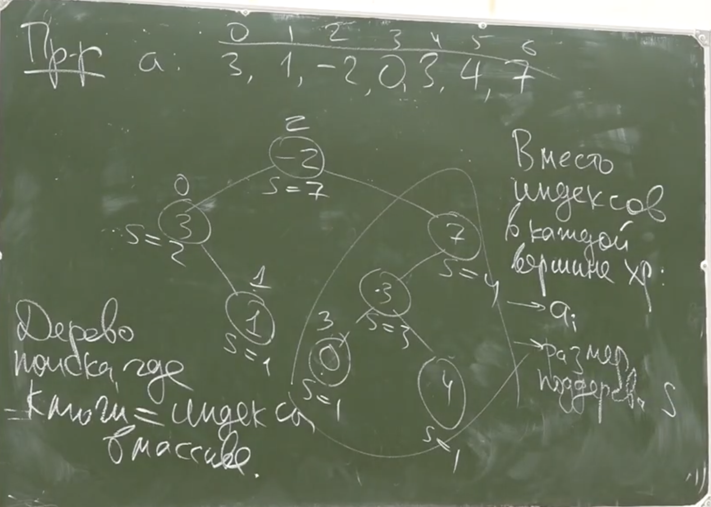

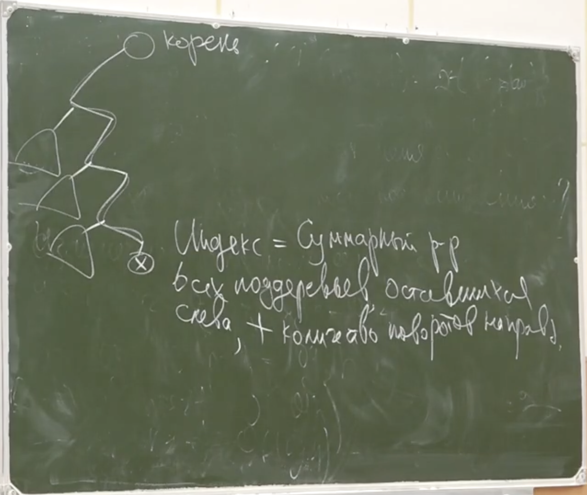

_**На примере splay-дерева** все операции останутся теми же, только после каждого изменения дерева(повороты, splay, merge, split) **будем пересчитывать кол-во эл-ов в поддеревьях** для каждого изменненого узла._

---

_**Стоит обратить внимание**, что наш **"неявный ключ"(индекс) упорядочен** от 0 до n и восстанавливается единственным образом, поэтому операции **merge и split работают корректно**._

---

_**Также на неявном splay-дереве удобно реализовать getSum, возвращающую сумму на подотрезке, т.к. можем при помощи splay достать подотрезок, и если дополнительно хранить в узле сумму ключей в поддеревьях, то получим ответ.**_

---

#### Декартово дерево

**Implement me!!!**

| Параметр | Значение / Описание |
| :--- | :--- |
| **Инвариант** | Двойной инвариант: **1.** BST по ключу (key). **2.** Куча по приоритету (priority). |
| **Пространственная сложность** | `O(n)` |
| **Вставка (split + merge)** | `O(log n)` в среднем |
| **Удаление (split + merge)** | `O(log n)` в среднем |
| **Поиск** | `O(log n)` в среднем |
| **Split (разделение)** | `O(log n)` |
| **Merge (слияние)** | `O(log n)` |
| **Построение за O(n)** | Да, если ключи отсортированы, а приоритеты убывают (стековый алгоритм). |

---

#### B-дерево

**Implement me!!!**

| Параметр | Значение / Описание |
| :--- | :--- |
| **Инвариант** | 1. Каждый узел (кроме корня) имеет от `⌈m/2⌉ - 1` до `m - 1` ключей.<br>2. Корень имеет от 1 до `m-1` ключей (или от 2 детей, если не лист).<br>3. Все листья на одной глубине.<br>4. Узел с `k` ключами имеет `k+1` детей. |
| **Пространственная сложность** | `O(n)` |
| **Вставка** | `O(log_m n)` |
| **Удаление** | `O(log_m n)` |
| **Поиск** | `O(log_m n)` |
| **Разделение узла (split)** | `O(m)` |
| **Слияние узлов (merge)** | `O(m)` |

---

#### Красно-черное дерево

**Implement me!!!**

| Параметр | Значение / Описание |
| :--- | :--- |
| **Инвариант** | 1. Узел — **красный** или **чёрный**.<br>2. Корень — чёрный.<br>3. Листья (NIL) — чёрные.<br>4. У красного узла оба ребёнка чёрные.<br>5. Все пути от узла до листьев содержат одинаковое число чёрных узлов (чёрная высота). |
| **Пространственная сложность** | `O(n)` |
| **Вставка** | `O(log n)` |
| **Удаление** | `O(log n)` |
| **Поиск** | `O(log n)` |
| **Балансировка (повороты)** | `O(1)` на операцию |
| **Построение из n элементов** | `O(n log n)` |

---

### Обходы бинарного дерева

#### Виды обходов и асимптотика

| Обход | Порядок (узел `N`, лево `L`, право `R`) | Временная сложность | Пространственная сложность (стек) |
| :--- | :--- | :--- | :--- |
| **Inorder (симметричный)** | `L → N → R` | `O(n)` | `O(h)` (высота дерева) |
| **Preorder (прямой)** | `N → L → R` | `O(n)` | `O(h)` |
| **Postorder (обратный)** | `L → R → N` | `O(n)` | `O(h)` |

**Примечание:** _`h` — высота дерева. Для сбалансированного дерева `h = O(log n)`, для вырожденного `h = O(n)`._

---

#### Inorder Traversal

_Возвращает ключи узлов дерева в **отсортированном порядке**_

```cpp
func inorderTraversal(x : Node):
   if x != null
      inorderTraversal(x.left)
      print x.key
      inorderTraversal(x.right)
```

---

#### Preorder Traversal

_Позволяет **восстановить дерево по
последовательности**, выведенной после
выполнения данной процедуры **единственным образом**._

`Бесполезен для Декартового дерева, т.к. оно всегда восстанавливается единственным образом`

```cpp
func preorderTraversal(x : Node)
   if x != null
      print x.key
      preorderTraversal(x.left)
      preorderTraversal(x.right)
```

---

#### Postorder Traversal

_Удобен для **удаления** эл-ов из дерева, т.к. обходит дерево **начиная с лисьтьев**_

```cpp
func postorderTraversal(x : Node)
   if x != null
      postorderTraversal(x.left)
      postorderTraversal(x.right)
      print x.key
```

---

## Банк вопросов

### Осень 2025

#### Лекторские вопросы

 1. **Приведите пример алгоритма, работающего за O(n^3 \* log n).**
 2. **Какова асимптотика работы алгоритма сортировки слиянием? Является ли она устойчивой? Если да - докажите, если нет – приведите пример**
 3. **Покажите как будет работать быстрая сортировка на массиве 5, 10, 4, 8, 1, 2 при выборе опорного элемента последним**
 4. **Приведите пример опорного элемента и массива, при котором быстрая сортировка будет работать за квадратичное время**
 5. **Покажите как работает неустойчивая сортировка подсчетом на массиве 5, 2, 7, 9, 1, 2, 7, 9, 3, 5**
 6. **За сколько работают основные операции в очереди?**
 7. **Покажите, как будет выглядеть структура односвязного списка и продемонстрируйте вставку в него элементов 2, 5, 8, удаление элемента 5, 8.**
 8. **Что такое очередь с приоритетом? Какие в ней есть операции и за какое время они работают?**
 9. **Расскажите, как удалять элемент из двоичного дерева поиска (3 ситуации) и приведите примеры. За какое время работает операция удаления?**
10. **Покажите пример малого правого поворота в АВЛ дереве. Когда он используется?**
11. **Оцените асимптотику работы приведенного ниже алгоритма: def algo (n): for i = 1 to 2n for j = i downto sqrt(i) print(‘Ура!’)**
12. **Покажите как будет работать слияние массивов 2, 5, 10, 12 и 4, 7, 8, 9, 10**
13. **Сколько операций совершит сортировка слиянием, если будет запущена на отсортированном массиве?**
14. **Зачем нужна рандомизация опорного элемента в быстрой сортировке?**
15. **Возможно ли применить цифровую сортировку для массива 415, 26, 7, 118, 210? Если да – расскажите как, если нет – докажите**
16. **За сколько работают основные операции в стеке?**
17. **Расскажите как строится куча при помощи просеиваний вниз. Почему при таком подходе можно просеивать только элементы из первой половины кучи?**
18. **Покажите как будет меняться изначально пустая очередь с приоритетом при выполнении следующих команд: \* enqueue(10) \* enqueue(4) \* enqueue(8) \* dequeue() \* enqueue(12) \* dequeue()**
19. **Какие обходы двоичного дерева поиска вы знаете? Для чего их можно применять?**
20. **Что такое бин поиск по ответу (вещественный бин поиск) и в каких задачах его можно применять? Какое при таком алгоритме условие выхода из цикла?**

---

#### Собственные вопросы

1. **Устойчивость сортировок и почему она выполняется**
2. **Сортировка подсчетом(и радикс соответственно) для отрицательных чисел**
3. **Асимптотика сортировок по памяти(лучший,средний, худший случаи)**
4. **Виды куч**
5. **Сколько свапов в среднем делает сортировка вставками(мат ожидание)**
6. **Почему можно использовать вещественный бин поиск для поиска корня функции(если он существует)**
7. **MSD и ее особенности**
8. **Инвариант алгоритмов**
9. **Лучший/средний/худший случаи для сортировок(когда наступают, асимптотика)**
10. **Асимптотика дин проги**
11. **Quicksort Ломуто и его асимптотика**
12. **НВП за nlogn через бин поиск**
13. **Определение $O(n), \Omega(n), \Theta(n)$**
14. **Циклические списки**
15. **Стек с минимумом**
16. **DEQ**

---

### Весна 2025

#### Лекторские вопросы

**...**

#### Собственные вопросы

**...**

---
